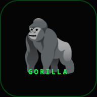

---
hide:
  - navigation
  - toc
---

  <h1>Hey, I'm Mo</h1>
  
Platform engineer in Taipei, Taiwan — building infrastructure, developer platforms, and open-source tools.

  

    <a href="projects/" class="primary">Projects</a>
    <a href="about/" class="secondary">About me</a>
  

<h2 class="section-title">Gorilla Ecosystem</h2>

A self-hosted AI fitness coaching platform — training tracker, Garmin sync, conversational AI coach.

  

    
    <h3><a href="projects/gorilla-coach/">gorilla_coach</a></h3>
    
Full-stack fitness app. Periodized training (5/3/1, BBB), mesocycle management, e1RM tracking, dashboard, PWA. Rust — Dioxus + Axum.

  

  

    
🤖

    <h3><a href="projects/gorilla-mcp/">gorilla_mcp</a></h3>
    
MCP server + chatbot gateway. 17 tools, 3 resources, 4 prompts — gives Claude access to training data and Garmin biometrics.

  

  

    
⌚

    <h3><a href="projects/gapi/">gapi</a></h3>
    
Garmin Connect API service. OAuth, parallel sync of 12 health endpoints, 42+ daily metrics, webhook dispatch. Rust + SQLite.

  

<h2 class="section-title">Claude Code Tooling</h2>

Plugins for monitoring and managing Claude Code sessions in your terminal workflow.

  

    
👁️

    <h3><a href="projects/cc-watcher/">cc-watcher.nvim</a></h3>
    
Neovim plugin — real-time sidebar, inline diffs, hunk navigation, 14 integrations (snacks, trouble, diffview, conform, flash...).

  

  

    
🔔

    <h3><a href="projects/tmux-cc-attention/">tmux_cc_attention</a></h3>
    
tmux plugin — visual indicators when Claude needs attention. Cross-session awareness, session dashboard, bundled color themes.

  

<h2 class="section-title">Side Projects</h2>

Experiments, games, and tools — all in Rust.

  

    
📱

    <h3><a href="projects/lifemanager/">lifemanager</a></h3>
    
Cyberpunk mobile PWA — to-dos, groceries, package tracking with OCR, watchlist, cycle tracker. Rust + Dioxus + Tailwind.

  

  

    
🎮

    <h3><a href="projects/retrogames/">retrogames</a></h3>
    
9 retro browser games with Miyoo Mini Plus ports. Single-file HTML5 Canvas, touch controls, CRT overlay. Rust/Macroquad for native.

  

  

    
🔧

    <h3><a href="https://github.com/elmomk/dotfiles">dotfiles</a></h3>
    
Arch Linux / Hyprland / Quickshell / Neovim — my daily driver setup.

  

<h2 class="section-title">Stack</h2>

  

    <h3>Languages</h3>
    

      
      
      
      
      
      
    

  

  

    <h3>Infrastructure</h3>
    

      
      
      
    

  

  

    <h3>Platforms</h3>
    

      
      
      
      
    

  

  

    <h3>Tools</h3>
    

      
      
      
    

  

