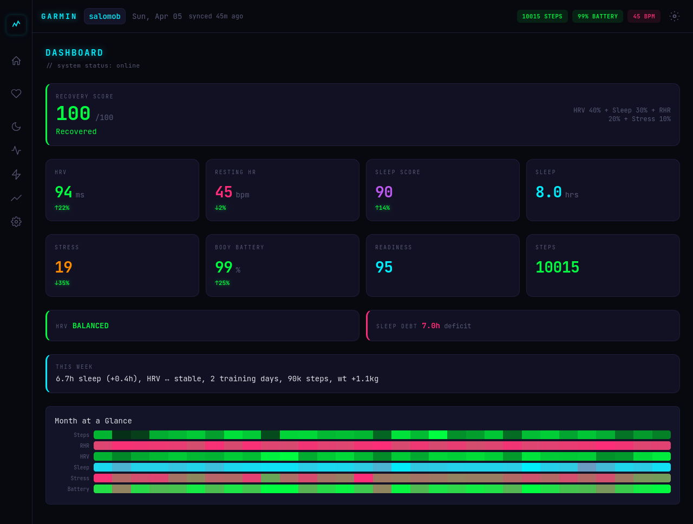
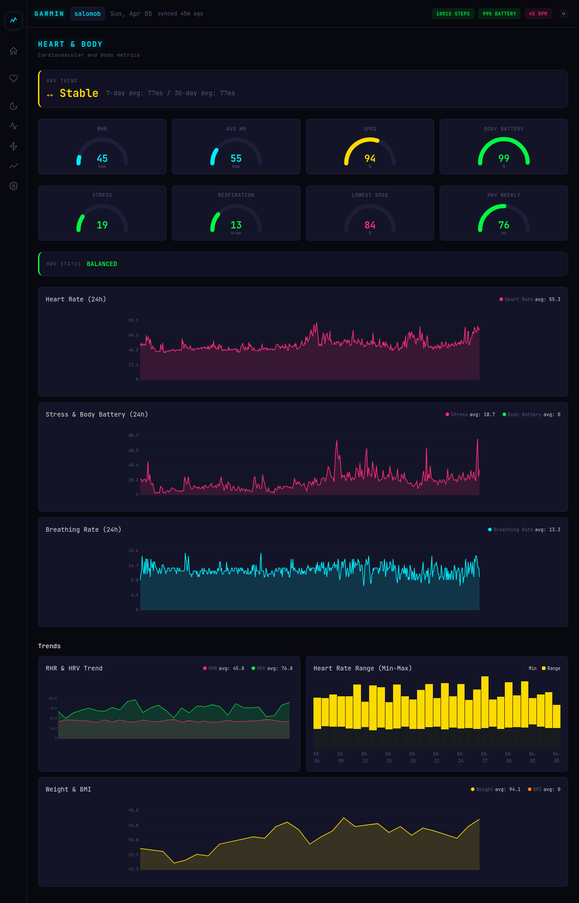
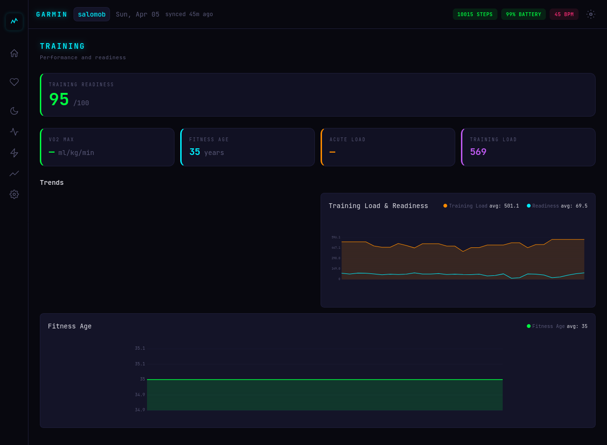
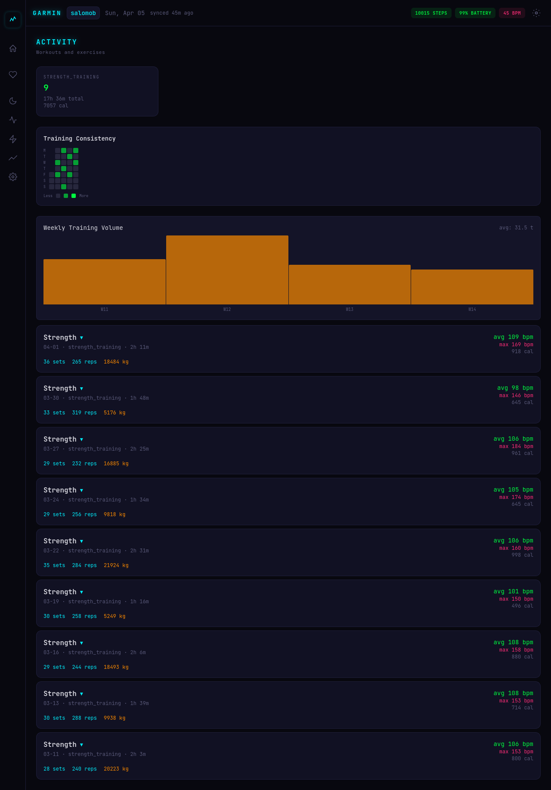
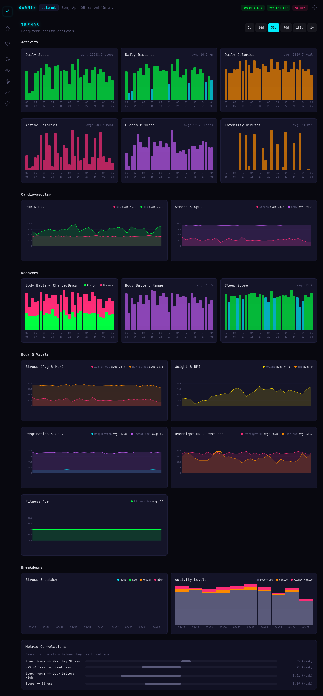

# :material-watch: gapi

!!! quote "Standalone Garmin Connect API service with event-driven architecture and a cyberpunk health dashboard"

## Stack

:fontawesome-brands-rust: **Axum 0.8** — Backend API
{ .card }

:material-language-rust: **Leptos 0.7** — Dashboard (WASM)
{ .card }

:material-database: **SQLite** — WAL mode, r2d2 pool
{ .card }

:material-lock: **ChaCha20Poly1305** — Encryption at rest
{ .card }

## Features

-   :material-key:{ .lg .middle } **Garmin Connect Auth**

    ---

    SSO authentication via OAuth1/OAuth2 with MFA support. Encrypted credential storage.

-   :material-sync:{ .lg .middle } **Parallel Sync**

    ---

    14 health endpoints synced in parallel — HR, HRV, sleep, stress, body battery, SpO2, respiration, weight, training readiness, VO2 max, fitness age, race predictions, activities, steps.

-   :material-chart-box:{ .lg .middle } **50+ Daily Metrics**

    ---

    Daily aggregates + intraday time series. Extended metrics including fitness age and race predictions.

-   :material-webhook:{ .lg .middle } **Webhook Dispatch**

    ---

    Event-driven notifications with HMAC-SHA256 signing for downstream consumers like [gorilla_coach](gorilla-coach.md).

## Dashboard

!!! tip "7-page cyberpunk-themed health dashboard built with Leptos (Rust WASM)"

=== "Dashboard"

    { width="300" }

    *Recovery score, vitals overview, alerts, heatmap*

=== "Heart & Body"

    { width="300" }

    *HR, HRV, stress, SpO2, respiration, weight/BMI*

=== "Sleep"

    { width="300" }

    *Sleep debt, stages, efficiency, feedback*

=== "Training"

    { width="300" }

    *Readiness, VO2 max, fitness age, load trends*

=== "Activity"

    { width="300" }

    *Consistency, volume, exercise details*

=== "Trends"

    { width="300" }

    *30+ charts with section grouping, correlations*

<a href="https://github.com/elmomk/gapi" class="md-button">View on GitHub</a>

