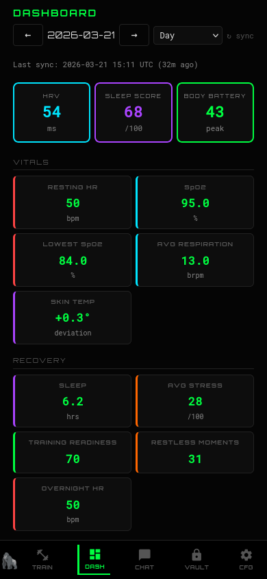
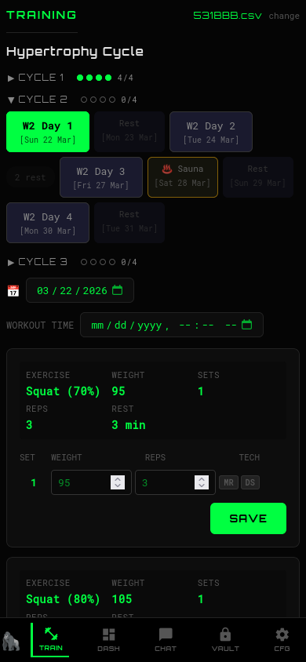
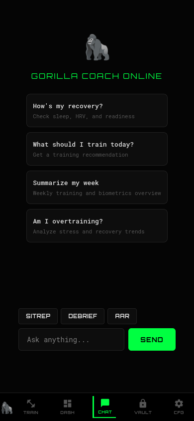

# :material-dumbbell: gorilla_coach

!!! quote "A self-hosted AI fitness coaching platform built entirely in Rust"

## Stack

:fontawesome-brands-rust: **Dioxus 0.7** — Frontend (Rust WASM)
{ .card }

:material-server: **Axum** — Backend API
{ .card }

:material-database: **PostgreSQL** — Database
{ .card }

:material-docker: **Docker** — Deployment
{ .card }

## Features

-   :material-weight-lifter:{ .lg .middle } **Training Tracker**

    ---

    Log sets against periodized plans (5/3/1, BBB, hypertrophy). Draft persistence, Google Sheets write-back.

-   :material-chart-timeline-variant:{ .lg .middle } **Mesocycle Management**

    ---

    DB-backed templates with cycle percentages, per-set weights, auto-progression, macrocycle sequencing.

-   :material-robot:{ .lg .middle } **AI Coach**

    ---

    Conversational coaching via Claude AI through [gorilla_mcp](gorilla-mcp.md). SITREP, AAR, and DEBRIEF reports.

-   :material-watch:{ .lg .middle } **Garmin Sync**

    ---

    Biometric data via [gapi](gapi.md) — 50+ daily metrics, activities, dashboard visualizations.

-   :material-shield-check:{ .lg .middle } **Security**

    ---

    ChaCha20Poly1305 encryption at rest, CSRF, rate limiting, CSP headers, signed cookies.

-   :material-cellphone:{ .lg .middle } **Mobile PWA**

    ---

    Installable Progressive Web App with offline caching, service worker, IndexedDB persistence.

## Screenshots

=== "Dashboard"

    { width="300" }

    *Garmin biometrics at a glance — recovery score, vitals, alerts*

=== "Training"

    { width="300" }

    *Log sets against your periodized plan*

=== "AI Coach"

    { width="300" }

    *Conversational coaching with SITREP, AAR, and DEBRIEF modes*

<a href="https://github.com/elmomk/rusty_gorilla_coach" class="md-button">View on GitHub</a>

