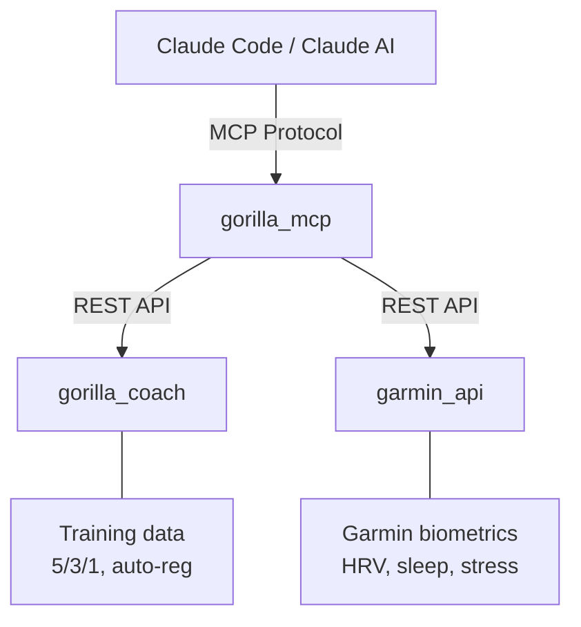

# :material-robot: gorilla_mcp

!!! quote "MCP server + chatbot gateway — gives Claude access to training data and Garmin biometrics"

## Architecture

## Capabilities

-   :material-wrench:{ .lg .middle } **14 Tools**

    ---

    Query training logs, check readiness, log sets, analyze recovery trends, get auto-regulation advice.

-   :material-database:{ .lg .middle } **3 Resources**

    ---

    Training plans, exercise library, user profiles — exposed as MCP resources.

-   :material-message-text:{ .lg .middle } **4 Prompts**

    ---

    SITREP (daily status), AAR (after action review), DEBRIEF (weekly trends), coaching conversation.

## Binaries

| Binary | Purpose |
|--------|---------|
| :material-server: **gorilla_mcp** | MCP server — tools, resources, prompts. Stdio or HTTP/SSE transport. |
| :material-chat: **gorilla_chatbot** | Web chat UI that spawns Claude CLI with MCP tools. Also serves as LLM gateway. |

## Stack

:fontawesome-brands-rust: Rust (2024 edition) · :material-server: Axum · :material-robot: Claude AI via MCP protocol

<a href="https://github.com/elmomk/gorilla_mcp" class="md-button">View on GitHub</a>

