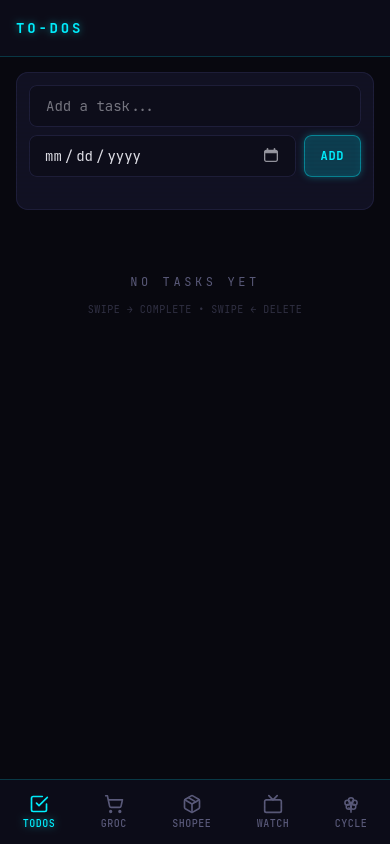
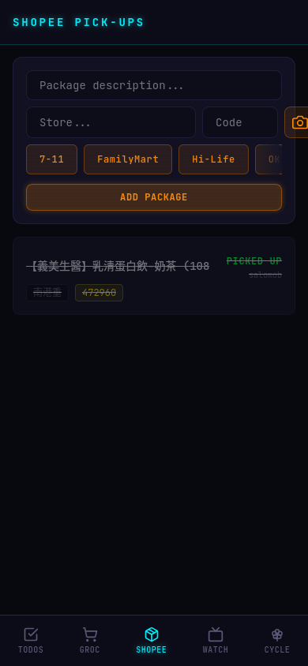
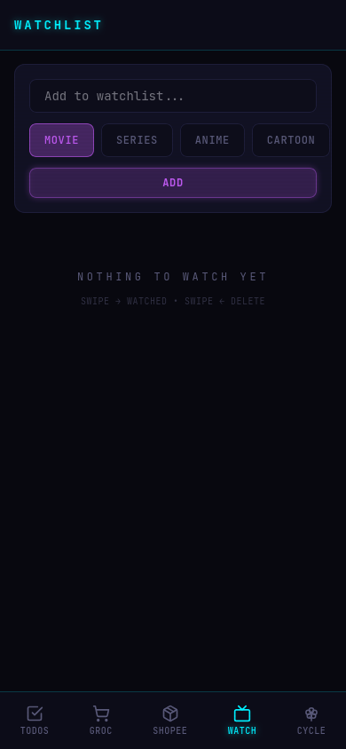

# :material-cellphone: Life Manager

!!! quote "Cyberpunk-themed mobile-first PWA for managing daily life — Rust + Dioxus + Tailwind"

## Modules

-   :material-checkbox-marked:{ .lg .middle } **To-Dos**

    ---

    Task tracking with quick-add chips and optional due dates. Swipe to complete or delete.

-   :material-cart:{ .lg .middle } **Groceries**

    ---

    Shopping list with swipe-to-complete and dynamic defaults. Saved favorites for quick re-add.

-   :material-package:{ .lg .middle } **Shopee Pick-ups**

    ---

    Package tracking with OCR extraction from screenshots — product name, store location, pickup code. Traditional Chinese + English.

-   :material-filmstrip:{ .lg .middle } **Watchlist**

    ---

    Movie / Series / Anime / Cartoon tracker with status management.

-   :material-heart-pulse:{ .lg .middle } **Cycle Tracker**

    ---

    Period logging with symptom tracking, next-cycle prediction, PMS care reminders 10 days before.

## Stack

:fontawesome-brands-rust: **Dioxus 0.7** — Fullstack WASM
{ .card }

:material-palette: **Tailwind CSS v4** — Cyberpunk theme
{ .card }

:material-database: **SQLite** — r2d2 pool
{ .card }

:material-text-recognition: **Tesseract** — OCR (chi_tra + eng)
{ .card }

## Screenshots

=== "To-Dos"

    { width="280" }

=== "Groceries"

    { width="280" }

=== "Shopee"

    { width="280" }

=== "Watchlist"

    { width="280" }

<a href="https://github.com/elmomk/lifemanager" class="md-button">View on GitHub</a>

