# Gorilla Coach Ecosystem -- Architecture Document

This document describes the complete architecture of the Gorilla Coach ecosystem: all services, how they communicate, internal design decisions, data flows, and deployment topology.

---

## Table of Contents

- [System Overview](#system-overview)
- [Component Diagram](#component-diagram)
- [Service Inventory](#service-inventory)
- [Tailscale Network Topology](#tailscale-network-topology)
- [Gorilla Coach Internal Architecture](#gorilla-coach-internal-architecture)
- [Authentication and Authorization](#authentication-and-authorization)
- [LLM Integration](#llm-integration)
- [Event-Driven Architecture](#event-driven-architecture)
- [Data Architecture](#data-architecture)
- [Deployment Architecture](#deployment-architecture)
- [Security Architecture](#security-architecture)

---

## System Overview

The Gorilla ecosystem consists of four independently deployed services, all connected over a private Tailscale mesh VPN:

| Service | Role | Stack | Database |
|---------|------|-------|----------|
| **gorilla_coach** | Main app: training tracker, dashboard, AI chat UI | Rust/Axum + Dioxus Wasm PWA | PostgreSQL 16 (TimescaleDB) |
| **garmin_api** | Garmin Connect data service with webhook events | Rust/Axum | SQLite (WAL mode) |
| **gorilla_mcp** | MCP server + chatbot gateway for Claude AI | Rust (rmcp + Axum) | None (stateless + cache) |
| **life_manager** | Household PWA (to-dos, groceries, watchlist) | Rust/Dioxus 0.7 fullstack | SQLite |

These are separate git repositories, each with independent Docker Compose deployments. They communicate exclusively over HTTP/JSON APIs on the Tailscale private network.

---

## Component Diagram

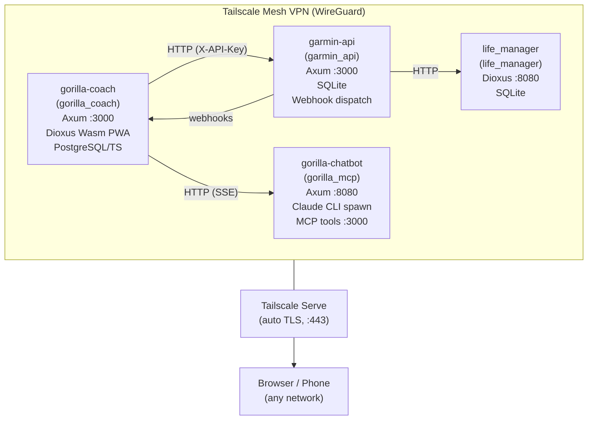

### Data Flow Summary

1. **Browser** connects to gorilla_coach (training, dashboard, chat) and life_manager (household tasks) over Tailscale HTTPS
2. **gorilla_coach** fetches Garmin biometric data from **garmin_api** via REST (X-API-Key auth)
3. **gorilla_coach** delegates AI chat to **gorilla_mcp** chatbot gateway via SSE streaming
4. **gorilla_mcp** (MCP server mode) calls back into **gorilla_coach** and **garmin_api** to fetch data for Claude's tool calls
5. **garmin_api** pushes webhook events (daily_data_synced, sync_completed) to registered consumers
6. **life_manager** reads from both gorilla_coach and garmin_api for cross-service features

---

## Service Inventory

### gorilla_coach (This Repository)

**Purpose:** Primary fitness coaching platform -- training tracking, mesocycle management, Garmin dashboard, AI chat UI, Google Calendar/Sheets sync.

**Tech:** Rust, Axum 0.8, Dioxus 0.7 Wasm PWA, PostgreSQL 16 (TimescaleDB), sqlx 0.8

**Deployment:** 3 containers (tailscale + app + db)

**Key files:**
- `gorilla_server/src/main.rs` -- Entry point, router, middleware stack
- `gorilla_server/src/config.rs` -- All env var parsing (`AppConfig`)
- `gorilla_server/src/handlers/` -- HTTP handlers (v2 API, auth, chat, sync)
- `gorilla_client/src/` -- Dioxus Wasm PWA components
- `gorilla_shared/src/` -- Domain models shared between server and client

### garmin_api

**Repository:** `/home/mo/data/Documents/git/garmin_api`

**Purpose:** Standalone Garmin Connect data service. Handles OAuth authentication (SSO + MFA), background data sync across 12 health endpoints in parallel, encrypted credential storage, and webhook-based event dispatch. Extracted from gorilla_coach to serve as a shared data source.

**Tech:** Rust, Axum 0.8, SQLite (rusqlite + r2d2, WAL mode), ChaCha20Poly1305

**Deployment:** 2 containers (tailscale + app), no database container needed (SQLite)

**API:** REST with X-API-Key auth. Key endpoints:
- `POST /api/v1/users/{id}/credentials` -- Register Garmin credentials
- `POST /api/v1/users/{id}/sync` -- Trigger on-demand sync
- `GET /api/v1/users/{id}/daily?date=...` -- Query daily health data
- `GET /api/v1/users/{id}/vitals` -- Today + 7-day baseline
- `POST /api/v1/webhooks` -- Register webhook consumer

**Events:** HMAC-SHA256 signed webhooks with 3-retry exponential backoff:
- `daily_data_synced` -- Each day's data saved (full payload)
- `sync_completed` -- Full sync finishes (days_synced, errors, duration)
- `sync_failed` -- Auth or rate limit failure

### gorilla_mcp

**Repository:** `/home/mo/data/Documents/git/gorilla_mcp`

**Purpose:** Two-crate workspace providing (1) an MCP server that bridges Claude AI to training data and Garmin biometrics, and (2) a web-based chatbot with a gateway API for gorilla_coach.

**Tech:** Rust, rmcp (MCP protocol), Axum, Claude CLI

**Deployment:** 4 containers total:
- `tailscale` + `app` (MCP SSE server on :3000) -- for external MCP consumers
- `tailscale-chatbot` + `gorilla-chatbot` (Chat UI + gateway on :8080) -- for browser and gorilla_coach

**MCP Server (gorilla_mcp):**
- 10 tools: get_training_plan, get_e1rm_history, get_exercise_history, get_garmin_daily, get_garmin_vitals, get_garmin_baseline, get_auto_regulator, log_training_sets, log_auto_reg, trigger_garmin_sync
- 3 resources: gorilla://settings, gorilla://files, gorilla://garmin/status
- 4 prompts: readiness_check, weekly_review, program_evaluation, recovery_analysis
- Supports stdio and HTTP/SSE transports
- Calls gorilla_coach v2 API and garmin_api via HTTP clients with X-API-Key auth
- ResponseCache (moka, 5-min TTL) for vitals and baseline data

**Chatbot Gateway (gorilla_chatbot):**
- `POST /api/gateway` -- For gorilla_coach. Spawns Claude CLI without MCP tools (gorilla_coach bakes data into the prompt). Authenticated via X-API-Key header.
- `POST /api/chat` -- Browser-facing. Spawns Claude CLI with MCP config pointing to gorilla_mcp. Manages conversation history (20 entries, file-backed).
- Core function: `stream_claude(mcp_config, model, message, system_prompt, tx, ct)` -- spawns CLI process, streams SSE

### life_manager

**Repository:** `/home/mo/data/Documents/git/life_manager`

**Purpose:** Household management PWA with five modules: To-Dos, Groceries, Shopee Pick-ups, Watchlist, and Cycle Tracker.

**Tech:** Rust, Dioxus 0.7 (fullstack -- both server and Wasm client), Tailwind CSS v4, SQLite

**Deployment:** 2 containers (tailscale + app)

**Cross-service connections:**
- `GORILLA_COACH_URL` + `GORILLA_COACH_API_KEY` -- reads training data
- `GARMIN_API_URL` + `GARMIN_API_KEY` -- reads health metrics
- `GOOGLE_SA_KEY_FILE` -- Google Calendar integration
- `TMDB_API_KEY` -- Movie/TV metadata for watchlist

---

## Tailscale Network Topology

All services run on the same private Tailscale mesh VPN (tailnet). Each service gets its own Tailscale hostname and automatic TLS certificate via Tailscale Serve.

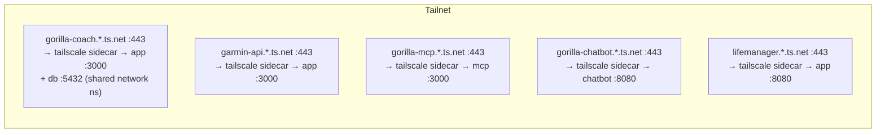

**Key properties:**
- No port forwarding, no public internet exposure
- Tailscale ACLs control which devices/users can access each service
- Each sidecar has its own TS_AUTHKEY and `ts-serve.json` config
- Services reference each other by Tailscale FQDN (e.g., `https://garmin-api.<tailnet>.ts.net`)
- DNS resolution via Tailscale MagicDNS (`100.100.100.100`)

---

## Gorilla Coach Internal Architecture

### Three-Crate Workspace

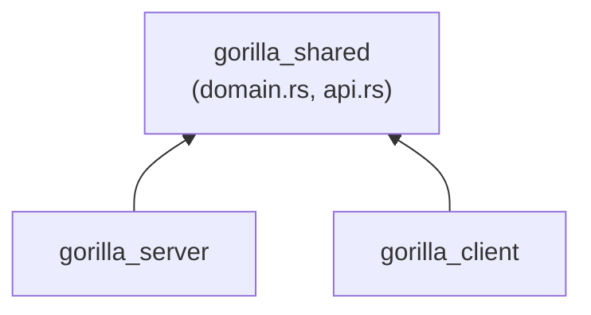

**gorilla_shared** (`gorilla_shared/src/`):
- `domain.rs` -- Core types: `User`, `GarminDailyData`, `GarminActivity`, `PrimaryLift`, `normalize_lift_name()`
- `api.rs` -- Request/response types with `#[serde(deny_unknown_fields)]` on critical types
- Optional `server` feature enables sqlx derives
- Used by both server and client via `[workspace.dependencies]`

**gorilla_server** (`gorilla_server/src/`):
- Axum 0.8 HTTP server, binary name `gorilla_coach`
- Handlers, repository layer, LLM subsystem, Garmin integration
- Background sync worker (hourly, tokio::spawn)
- Middleware stack: CSRF, rate limiting, security headers, HSTS, trace ID, compression

**gorilla_client** (`gorilla_client/src/`):
- Dioxus 0.7 Wasm SPA served at `/` via `fallback_service`
- Offline-first: IndexedDB cache with persistent handle, Service Worker
- Cache-first loading: show IndexedDB data instantly, refresh from network in background
- Chart.js integration via typed Wasm interop (Reflect::get + Function::call1, no eval())
- Self-hosted fonts (Orbitron, Roboto Mono, Material Icons)

### Request Flow

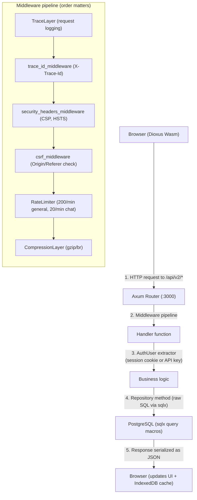

### Module Dependency Graph

```mermaid
graph TB
    Main["main.rs"] --> Config["config.rs<br/>(AppConfig::from_env)"]
    Main --> State["state.rs<br/>(AppState: repo, vault, config,<br/>cookie_key, llm, cache, metrics)"]
    Main --> MW["middleware/<br/>(csrf.rs, rate_limit.rs)"]
    Main --> Handlers["handlers/"]
    Main --> LLM["llm/<br/>(adapter.rs, chatbot_gateway.rs,<br/>noop.rs, analyst.rs)"]
    Main --> Reports["reports/<br/>(sitrep.rs, aar.rs, debrief.rs,<br/>gatekeeper.rs)"]
    Main --> Repo["repository/<br/>(mod.rs, users.rs, garmin.rs,<br/>training.rs, chat.rs, auto_reg.rs,<br/>mesocycle.rs)"]
    Main --> Vault["vault.rs<br/>(ChaCha20Poly1305 encryption)"]
    Main --> Util["util.rs<br/>(capitalize_first, build_day_label_info)"]

    Handlers --> HMod["mod.rs<br/>(AuthUser, get_session,<br/>sanitize_filename)"]
    Handlers --> Auth["auth.rs<br/>(login, logout, Google OAuth,<br/>dev-login)"]
    Handlers --> V2["v2/"]
    Handlers --> Chat["chat.rs<br/>(SSE streaming, tool-calling loop)"]
    Handlers --> ChatPrompt["chat_prompt.rs<br/>(system prompt construction)"]
    Handlers --> ChatTools["chat_tools.rs<br/>(tool definitions + ToolExecutor)"]
    Handlers --> Sync["sync.rs<br/>(background Garmin sync,<br/>cache invalidation)"]
    Handlers --> Cal["calendar.rs<br/>(Google Calendar event sync)"]
    Handlers --> Sheets["sheets.rs<br/>(Google Sheets read/write)"]
    Handlers --> Admin["admin.rs<br/>(admin-only endpoints)"]
    Handlers --> Negotiate["negotiate.rs<br/>(JSON/postcard content negotiation)"]

    V2 --> V2Mod["mod.rs<br/>(dashboard with moka cache + ETag)"]
    V2 --> Training["training.rs<br/>(plans, sets, schedule, e1RM)"]
    V2 --> Files["files.rs<br/>(uploads, Google Sheets import)"]
    V2 --> Settings["settings.rs<br/>(user settings, credentials)"]
    V2 --> AutoReg["auto_reg.rs<br/>(auto-regulation)"]
    V2 --> Meso["mesocycle/<br/>(templates.rs, generator.rs,<br/>macrocycle.rs)"]
```

### Caching Strategy

**Server-side (moka):**
- Dashboard cache in `AppState.dashboard_cache` with 5-minute TTL
- Keyed by `(user_id, view_type, date)` producing ETag-based conditional responses
- Invalidated by the background sync worker when new Garmin data arrives

**Client-side (IndexedDB):**
- Persistent IndexedDB handle opened once at app startup (`api.rs`)
- Training and dashboard data cached on every successful fetch
- Pages render cached data immediately, then refresh from network in background
- `storage.rs` provides `open_db()`, `put()`, `get()` helpers

**Service Worker (`public/sw.js`):**
- Versioned cache (`gorilla-coach-v{N}`), auto-bumped by `scripts/build.sh`
- Static assets: cache-first (stale-while-revalidate)
- API calls: network-first with 3-second timeout fallback to cache
- Navigation: SPA fallback (serve index.html for all routes)
- Push notification listener for training reminders

---

## Authentication and Authorization

### Session-Based Auth (Browser)

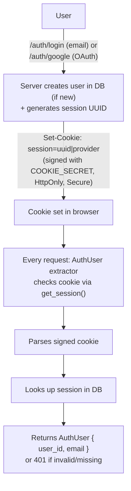

**Google OAuth flow:**
1. Browser redirects to `/auth/google` -> Google consent screen
2. Google redirects back to `/auth/callback` with auth code
3. Server exchanges code for tokens, extracts email
4. Creates/finds user, sets session cookie

**Dev-login:** When `DEV_LOGIN_ENABLED=true`, the `/auth/dev-login` route creates a session for `DEV_LOGIN_EMAIL` without OAuth. For local development only.

### API Key Auth (Service-to-Service)

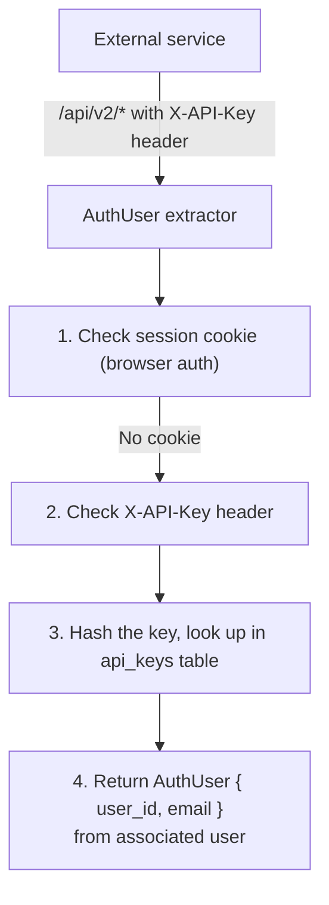

API keys are stored as SHA-256 hashes in the `api_keys` table. This allows gorilla_mcp and life_manager to call the gorilla_coach v2 API programmatically.

### Admin Authorization

Admin endpoints (`/api/admin/*`) require both a valid session AND the user's email in the `ADMIN_EMAILS` environment variable (comma-separated list).

---

## LLM Integration

### Chatbot Gateway Pattern

Gorilla Coach does not call LLM APIs directly. Instead, it delegates to the gorilla_mcp chatbot gateway:

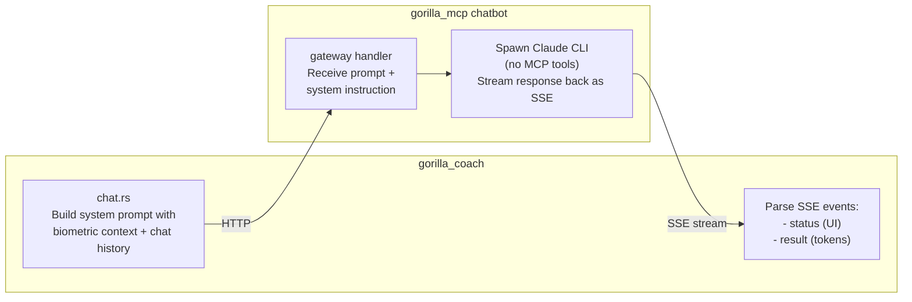

**Why this pattern?**
- gorilla_coach bakes all relevant data (biometrics, chat history, training context) into the system prompt
- The gateway just proxies to Claude CLI -- no tool calling needed at this layer
- MCP tools are used separately when Claude Desktop or other MCP clients connect to gorilla_mcp directly
- Keeps LLM API credentials (Anthropic key) out of gorilla_coach

### Adapter Pattern

The LLM subsystem uses a trait-based adapter pattern (`llm/adapter.rs`):

```rust
pub trait LlmAdapter: Send + Sync {
    async fn generate(&self, prompt: &str, system: &str) -> Result<String, AppError>;
    async fn generate_stream(&self, prompt: &str, system: &str, tx: Sender<...>);
    async fn generate_with_tools_stream(&self, prompt: &str, system: &str, tools: &[ToolDef], executor: &dyn ToolExecutor, tx: Sender<...>);
    fn model_name(&self) -> String;
    async fn health_check(&self) -> bool;
}
```

Two implementations:
- **ChatbotGatewayAdapter** (`chatbot_gateway.rs`) -- Calls gorilla_mcp gateway, parses SSE stream with status/result events, 120s request timeout
- **NoopAdapter** (`noop.rs`) -- Returns friendly error when no gateway is configured; deterministic reports (SITREP/AAR/DEBRIEF) still work

### Chat Flow

1. User sends message (or clicks SITREP/AAR/DEBRIEF button)
2. `chat.rs` builds system prompt via `chat_prompt.rs` (includes current date, last 7 days biometrics, chat history)
3. Defines tool definitions via `chat_tools.rs` (get_biometric_history, get_last_activity, analyze_metric, etc.)
4. Calls `llm.generate_with_tools_stream()` which:
   - Sends prompt to gateway
   - If gateway returns tool call -> executes via `ToolExecutor` -> sends result back -> repeats (up to 8 turns)
   - Streams final response tokens via SSE to browser
5. Browser renders markdown via marked.js

### AI Analyst

The analyst subsystem (`llm/analyst.rs`) handles natural-language data queries:
1. `detect_intent()` classifies the user's question into a metric + time range
2. `get_metric_stats()` generates safe SQL against `ALLOWED_METRICS` whitelist
3. Returns computed statistics without requiring LLM involvement

---

## Event-Driven Architecture

### Honest Assessment

The Gorilla ecosystem uses **HTTP-based communication**, not message queues or event buses. The "event-driven" aspects are limited to:

1. **Webhooks from garmin_api** -- HMAC-signed HTTP callbacks to registered consumers
2. **Background polling** -- Hourly sync workers that pull data on a schedule
3. **Cache invalidation** -- Server-side moka cache cleared when new data arrives
4. **Client-side optimistic updates** -- IndexedDB cache-first loading with background refresh

There is no shared message broker (Kafka, RabbitMQ, etc.). Each service owns its data and exposes it via REST APIs. This is appropriate for the scale (single user, handful of services).

### garmin_api Webhook Events

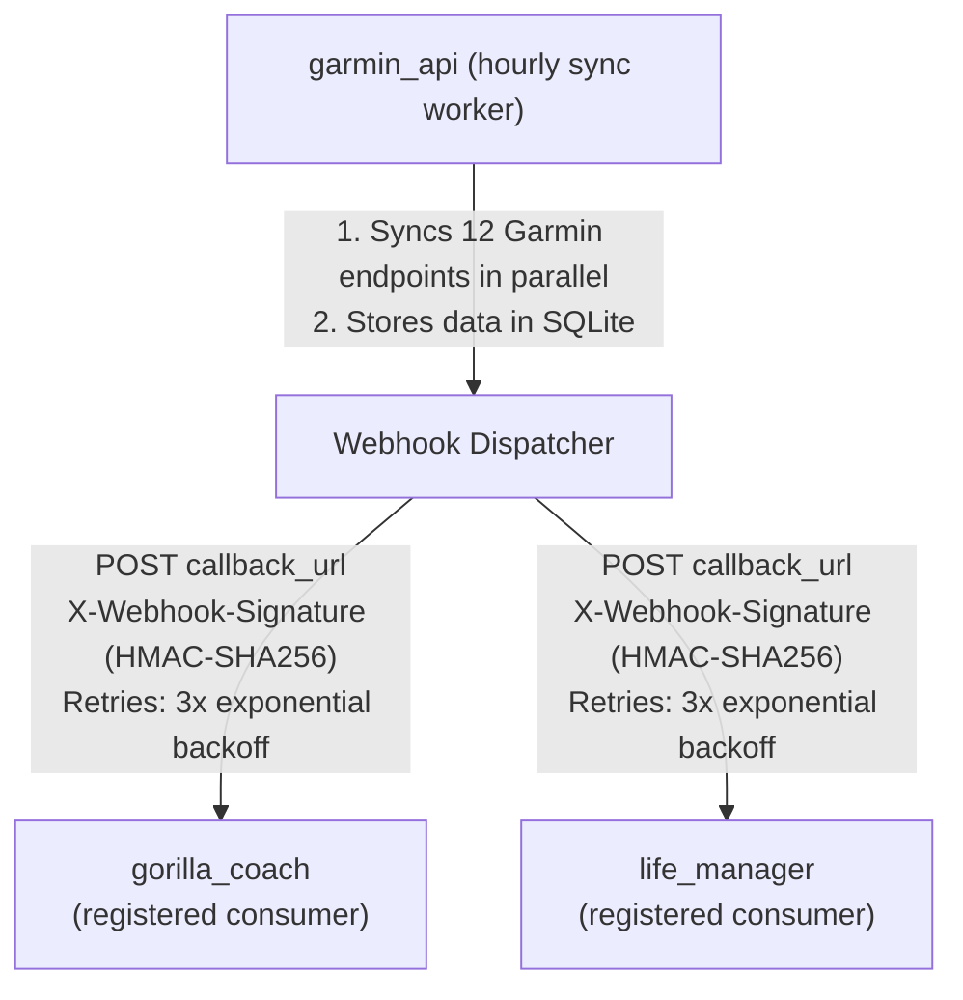

Events: `daily_data_synced`, `sync_completed`, `sync_failed`, `credentials_updated`

### Background Sync (gorilla_coach)

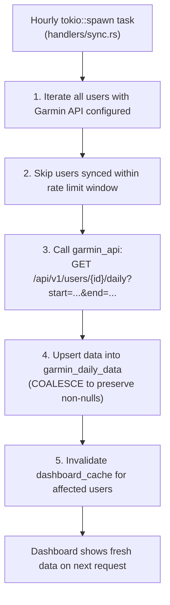

### Client-Side Cache-First Loading

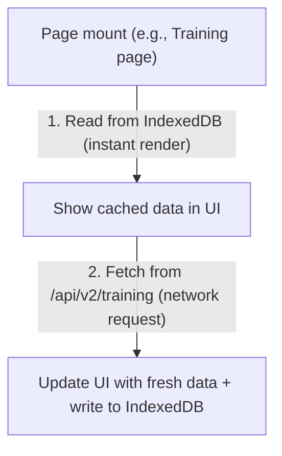

This pattern is used for training, dashboard, and settings pages. It eliminates loading spinners on repeat visits and provides offline capability.

### Schedule Change -> Calendar Sync

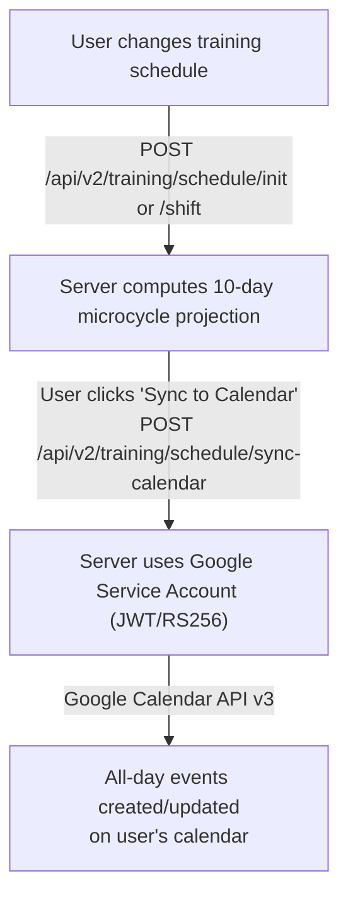

---

## Data Architecture

### PostgreSQL Schema Overview

The database uses PostgreSQL 16 with the TimescaleDB extension. Migrations live in `gorilla_server/migrations/` and auto-run on startup via `Repository::migrate()`.

**Core tables:**

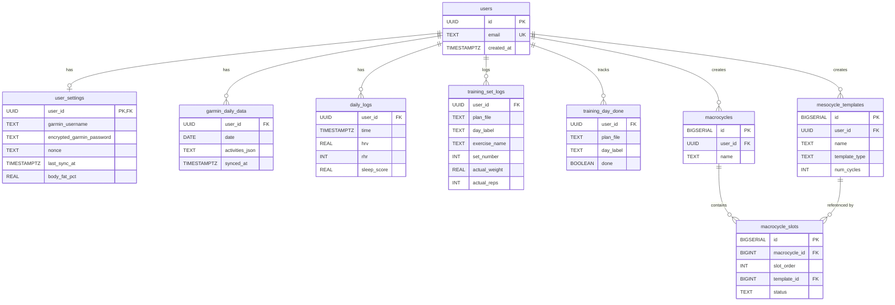

### TimescaleDB Usage

The `daily_logs` table is created as a TimescaleDB hypertable (partitioned by time) when the extension is available. This is done with graceful fallback:

```sql
DO $$ BEGIN
    PERFORM create_hypertable('daily_logs', 'time', if_not_exists => TRUE);
EXCEPTION WHEN OTHERS THEN
    RAISE NOTICE 'TimescaleDB not available, using plain Postgres table';
END $$;
```

The `garmin_daily_data` table is a regular PostgreSQL table (not a hypertable) since it is keyed by `(user_id, date)` and accessed by date range queries that don't benefit significantly from time-series partitioning at single-user scale.

### Migration Strategy

- Migrations are SQL files in `gorilla_server/migrations/`
- Named with timestamp prefix: `YYYYMMDD[NN]_description.sql`
- Auto-run on server startup via `Repository::migrate()` (sqlx built-in migrator)
- All use `IF NOT EXISTS` / `IF NOT EXISTS` guards for idempotency
- Foreign keys use `ON DELETE CASCADE` (users -> all child tables)
- `ON DELETE RESTRICT` for template references from macrocycle slots (prevent accidental template deletion)
- CHECK constraints enforce valid enum values and ranges

### Encryption at Rest

Sensitive data is encrypted using ChaCha20Poly1305 (AEAD cipher) via `vault.rs`:

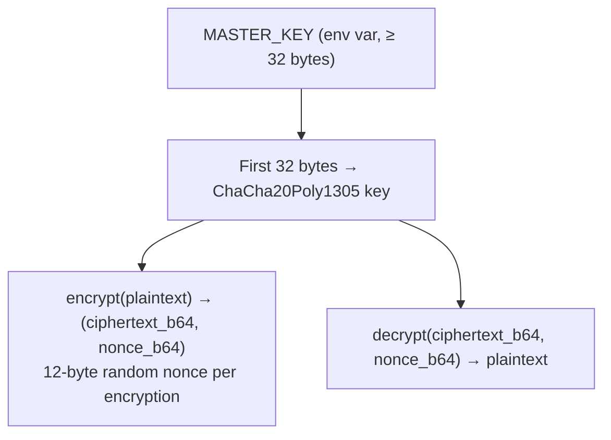

Encrypted fields:
- Garmin passwords (`user_settings.encrypted_garmin_password` + `nonce`)
- Garmin OAuth tokens
- Google refresh tokens

Changing the `MASTER_KEY` invalidates all stored encrypted data.

---

## Deployment Architecture

### Docker Compose with Tailscale Sidecar Pattern

Every service follows the same deployment pattern:

```yaml
services:
  tailscale:
    image: tailscale/tailscale:latest
    hostname: <service-name>
    environment:
      - TS_AUTHKEY=${TS_AUTHKEY}
      - TS_STATE_DIR=/var/lib/tailscale
      - TS_SERVE_CONFIG=/config/serve.json
    volumes:
      - ts-state:/var/lib/tailscale
      - ./ts-serve.json:/config/serve.json:ro
    cap_add:
      - NET_ADMIN
      - SYS_MODULE
    healthcheck:
      test: ["CMD", "tailscale", "status", "--json"]
      interval: 10s
      timeout: 5s
      retries: 10
      start_period: 30s

  app:
    build: .
    network_mode: service:tailscale  # <-- share tailscale's network namespace
    depends_on:
      tailscale:
        condition: service_healthy
```

### The `network_mode: service:tailscale` Pattern

This is the key deployment trick. By setting `network_mode: service:tailscale`, the app container shares the Tailscale sidecar's network namespace. This means:

- The app binds to `0.0.0.0:3000` but it's only reachable via the Tailscale network
- `localhost` inside the app container resolves to the tailscale container's loopback
- The tailscale `ts-serve.json` config proxies HTTPS :443 -> localhost:3000
- No Docker port mapping needed (`ports:` is not used)
- If the app needs to reach the database, the DB must also use `network_mode: service:tailscale` (gorilla_coach does this)

**Quirks:**
- The app container cannot resolve its own Tailscale hostname (circular dependency)
- DNS must be explicitly set to `100.100.100.100` (Tailscale MagicDNS) if the app needs to resolve other Tailscale hostnames
- `TS_USERSPACE=true` is needed when the app container needs internet access (e.g., gorilla_mcp chatbot calling api.anthropic.com)

### gorilla_coach Specific Deployment

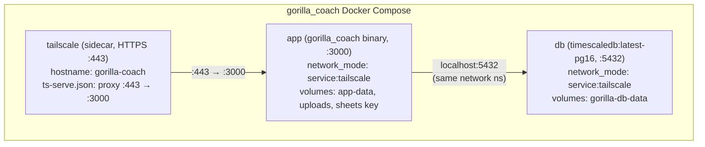

### Build Pipeline

gorilla_coach uses a local-build + thin-runtime-image pattern:

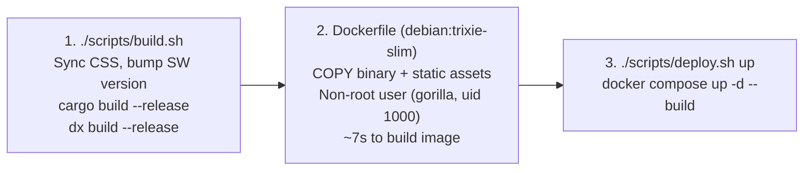

This avoids a multi-stage Docker build (which would require Rust + dioxus-cli in the image) and keeps the runtime image minimal.

### Startup Ordering

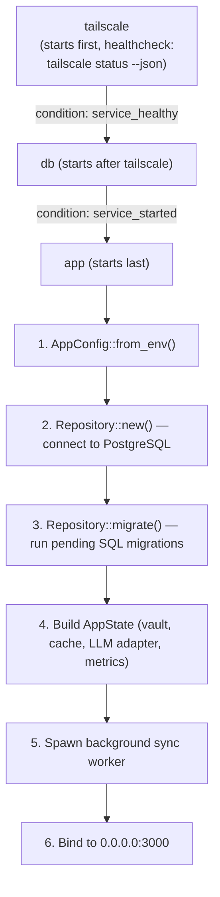

---

## Security Architecture

### Defense in Depth

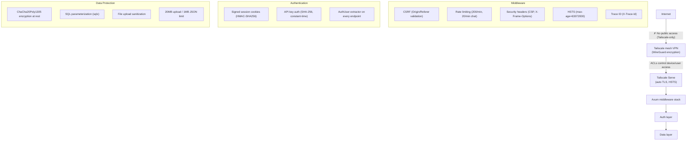

### Content Security Policy

```
default-src 'self';
script-src 'self';
style-src 'self' 'unsafe-inline';  (Dioxus injects styles at runtime)
connect-src 'self';
img-src 'self' data:;
font-src 'self'
```

No `unsafe-eval` -- all JS interop uses `Reflect::get` + `Function::call1`.

### Network Isolation

- All services are only accessible on the Tailscale tailnet
- No ports are exposed to the public internet
- Inter-service communication uses Tailscale DNS names with X-API-Key authentication
- Database (PostgreSQL) is only reachable within the Docker network namespace (no external port mapping)
- garmin_api webhook signatures use HMAC-SHA256 to verify payload authenticity

### Cookie Security

- Cookies signed with HMAC-SHA256 key derived from `COOKIE_SECRET`
- `HttpOnly` flag prevents JavaScript access
- `Secure` flag (when `COOKIE_SECURE=true`) ensures HTTPS-only transmission
- `SameSite=Lax` prevents CSRF on cross-origin requests
- CSRF middleware additionally validates Origin/Referer headers on all mutation requests (POST/PUT/DELETE)

### API Key Security

- Keys stored as SHA-256 hashes in the database (plaintext never stored)
- Constant-time comparison in gorilla_mcp gateway (via `subtle` crate)
- Each key is associated with a user account (inherits that user's permissions)
- `last_used_at` tracking for audit purposes

---

*Last updated: April 2026*
