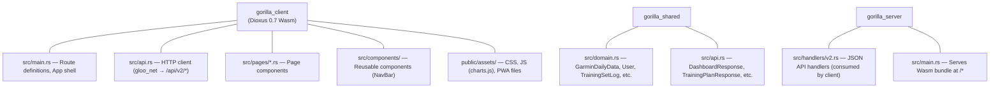

# Dioxus Wasm PWA Frontend

> *"The best code is no code at all. Every new line of code you willingly bring
> into the world is code that has to be debugged, code that has to be read and
> understood, code that has to be supported."*
> — Jeff Atwood, *Coding Horror* (2007)

This tutorial examines how Gorilla Coach builds a rich, interactive frontend —
with real-time streaming chat, interactive dashboards, file management, and a
training tracker — using **Dioxus 0.7**, a Rust-native reactive framework that
compiles to WebAssembly. The client runs as a **Progressive Web App** (PWA)
served from `/*`, consuming a headless **v2 JSON API**.

The project evolved from a server-rendered v1 architecture (HTML templates via
Rust format strings + htmx) to a client-side SPA with full type safety across
the wire. The v1 code still exists in `gorilla_server/src/ui/` for legacy
fallback, but all active development targets the Dioxus client.

---

## Reference Texts

| Abbreviation | Book |
|---|---|
| **PP** | Andrew Hunt & David Thomas — *The Pragmatic Programmer*, 20th Anniversary Ed. (2019) |
| **ZtP** | Luca Palmieri — *Zero To Production in Rust* (2022) |
| **CA** | Robert C. Martin — *Clean Architecture* (2017) |
| **DDIA** | Martin Kleppmann — *Designing Data-Intensive Applications* (2017) |
| **RiA** | Tim McNamara — *Rust in Action* (2021) |
| **OWASP** | OWASP Foundation — *OWASP Top 10* (2021) |

---

## Table of Contents

1. [Why Dioxus + Wasm](#1-why-dioxus--wasm)
2. [Architecture: Three-Crate Separation](#2-architecture)
3. [Client Entry Point and Routing](#3-routing)
4. [Component Patterns: Signals + Resources](#4-component-patterns)
5. [API Client: gloo_net + Shared Types](#5-api-client)
6. [Dashboard: Chart.js Interop via wasm-bindgen](#6-dashboard-chartjs)
7. [Chat: SSE Streaming from Wasm](#7-chat-sse)
8. [Training Tracker: Reactive Forms](#8-training-tracker)
9. [PWA: Service Worker, Manifest, Offline](#9-pwa)
10. [CSS Architecture](#10-css)
11. [Security: CSP, CSRF, XSS](#11-security)
12. [Build Pipeline](#12-build)
13. [Legacy v1 Architecture (Historical)](#13-legacy-v1)
14. [Further Reading](#14-further-reading)

---

## 1. Why Dioxus + Wasm

The original v1 frontend used server-rendered HTML (Rust format strings in
`ui.rs`) with htmx for interactivity and vanilla JavaScript. This worked well
for simple pages but hit friction points:

- **State management**: Complex page state (training tracker with per-set
  inputs, day tabs, mark-done toggles) required increasingly elaborate JS.
- **Type safety**: JSON responses were parsed with untyped JavaScript. Schema
  changes silently broke the client.
- **Code duplication**: Domain types were defined in Rust but reconstructed
  manually in JS. The `gorilla_shared` crate now eliminates this entirely.

Dioxus solves these with a Rust-native component model that compiles to Wasm:

- **Same language**: Server, client, and shared types are all Rust. A domain
  type change in `gorilla_shared/src/domain.rs` triggers compile errors in both
  `gorilla_server` and `gorilla_client`.
- **React-like DX**: RSX macro, signals for state, `use_resource` for async
  data fetching, client-side routing — familiar patterns with zero runtime cost.
- **PWA delivery**: The Wasm bundle is served as a static asset. The Axum server
  just needs to serve files at `/*` plus the v2 JSON API.

> **PP**, Tip 11: *"DRY — Don't Repeat Yourself."* The three-crate workspace
> ensures domain types and API contracts exist in exactly one place.

---

## 2. Architecture



**Data flow**: Dioxus component → `api::fetch_*()` → `GET /api/v2/*` → Axum v2
handler → Repository → PostgreSQL. Responses are deserialized into
`gorilla_shared` types which the client already knows at compile time.

> **CA**, Chapter 22: *"The dependency rule says source code dependencies must
> point only inward."* `gorilla_shared` is the innermost crate — it knows
> nothing about HTTP or Wasm. Both server and client depend on it, never the
> reverse.

---

## 3. Routing

Client-side routing uses the `#[derive(Routable)]` macro:

```rust
#[derive(Clone, Routable, PartialEq)]
enum Route {
    #[layout(AppShell)]
        #[route("/")]
        Chat {},
        #[route("/dashboard")]
        Dashboard {},
        #[route("/training")]
        Training {},
        #[route("/auto-reg")]
        AutoReg {},
        #[route("/files")]
        Files {},
        #[route("/settings")]
        Settings {},
    #[end_layout]
    #[route("/login")]
    Login {},
}
```

The `AppShell` layout component wraps all authenticated pages with a sidebar nav
and content area:

```rust
#[component]
fn AppShell() -> Element {
    rsx! {
        div { class: "app-shell",
            components::NavBar {}
            main { class: "content",
                Outlet::<Route> {}
            }
        }
    }
}
```

Navigation uses `Link { to: Route::Dashboard {} }` — no page reload, no server
round-trip. The Axum server has a catch-all that serves `index.html` for all
`/*` paths so that deep-linking and browser refresh work.

---

## 4. Component Patterns

### Signals for State

Dioxus uses signals (reactive primitives) instead of React's `useState`:

```rust
let mut view = use_signal(|| "day".to_string());  // reactive string
let mut syncing = use_signal(|| false);            // reactive bool
```

Writing to a signal (`view.set("week".into())`) automatically re-renders any
component that reads it. No explicit dependency arrays.

### use_resource for Async Data

Data fetching uses `use_resource`, which runs an async closure and re-runs when
its tracked signals change:

```rust
let dashboard = use_resource(move || {
    let v = view.read().clone();    // tracked: re-fetches when view changes
    let d = date.read().to_string();
    async move { api::fetch_dashboard(&v, Some(&d)).await }
});
```

The render path pattern-matches on the resource:

```rust
rsx! {
    match &*dashboard.read() {
        Some(Ok(data)) => rsx! { /* render data */ },
        Some(Err(e)) => rsx! { div { "Error: {e}" } },
        None => rsx! { div { class: "loading", "Loading..." } },
    }
}
```

### use_hook for One-Time Effects

Side effects that should run exactly once on mount use `use_hook`:

```rust
use_hook(move || {
    spawn(async move {
        let files = api::fetch_training_files().await;
        // reconcile server preference with localStorage
    });
});
```

---

## 5. API Client

All HTTP communication lives in `gorilla_client/src/api.rs`. It uses `gloo_net`
(a Wasm-compatible HTTP client) and deserializes into `gorilla_shared` types:

```rust
const API_BASE: &str = "/api/v2";

pub async fn fetch_dashboard(view: &str, date: Option<&str>) -> Result<DashboardResponse> {
    let mut url = format!("{API_BASE}/dashboard?view={view}");
    if let Some(d) = date { url.push_str(&format!("&date={d}")); }
    let resp = Request::get(&url).send().await.map_err(net_err)?;
    parse_response(resp).await
}
```

All response types (`DashboardResponse`, `TrainingPlanResponse`, etc.) are
defined in `gorilla_shared/src/api.rs` and derived with `Serialize +
Deserialize`. If the server changes a field name, the client won't compile.

Error handling uses a custom `ApiClientError` with status code and message.
Unauthorized (401) errors are detected via `is_unauthorized()` for redirect-to-
login flows.

---

## 6. Dashboard: Chart.js Interop

The dashboard page fetches `DashboardResponse` (a `Vec<GarminDailyData>`) and
renders metric cards in RSX. For charts, it calls Chart.js from Rust via
`wasm-bindgen`:

```rust
// In dashboard.rs — after data loads, invoke Chart.js
use wasm_bindgen::prelude::*;

#[wasm_bindgen(module = "/assets/charts.js")]
extern "C" {
    fn renderCharts(data_json: &str);
}
```

The `charts.js` file in `gorilla_client/public/assets/` receives JSON-serialized
Garmin data and renders Chart.js canvases. This pattern keeps chart rendering in
JavaScript (where Chart.js excels) while the data pipeline and UI frame remain
in Rust.

The dashboard supports day/week/month/year views with date navigation. View and
date are signals — changing either triggers `use_resource` to re-fetch and
re-render charts.

---

## 7. Chat: SSE Streaming

The chat page supports two modes:

### Quick Reports (v2 API)

SITREP, AAR, and DEBRIEF buttons call the v2 report endpoints:

```rust
let result = match report_type {
    "SITREP" => api::fetch_sitrep().await.map(|r| r.markdown),
    "AAR"    => api::fetch_aar().await.map(|r| r.markdown),
    "DEBRIEF"=> api::fetch_debrief().await.map(|r| r.markdown),
    _ => unreachable!(),
};
let html = md_to_html(&markdown);
messages.write().push(("gorilla".into(), html));
```

Markdown rendering uses `pulldown-cmark` (compiled to Wasm) instead of the
v1 approach of loading `marked.js`.

### Free-Form Chat (SSE Streaming)

Free-form messages POST to `/api/chat/stream` and parse the SSE response
manually (Wasm doesn't have native `EventSource` for POST requests):

```rust
let resp = Request::post("/api/chat/stream")
    .header("Content-Type", "application/x-www-form-urlencoded")
    .header("Accept", "text/event-stream")
    .body(form_body)
    .unwrap()
    .send()
    .await;

// Parse SSE data lines from response text
let text = response.text().await.unwrap_or_default();
for line in text.lines() {
    if !line.starts_with("data: ") { continue; }
    let data: serde_json::Value = serde_json::from_str(&line[6..])?;
    // Handle token chunks, status updates, tool call indicators
}
```

Messages are stored as `Vec<(String, String)>` (role, content_html) in a signal.
Each new token appends to the last message's HTML, providing streaming output.

---

## 8. Training Tracker

The training page is the most complex component, demonstrating several patterns:

### File Selection with Server Persistence

The active training plan file is persisted both in `localStorage` (instant on
reload) and on the server (syncs across devices). On mount, a `use_hook`
reconciles both sources:

```rust
use_hook(move || {
    spawn(async move {
        let files = api::fetch_training_files().await;
        // If localStorage value is stale, use server preference
        // If server has no preference, sync localStorage to server
    });
});
```

### Day Tabs with Auto-Select

Days are extracted from the parsed training plan CSV. Auto-select logic:
1. Today's weekday name (Monday, Tuesday, etc.)
2. First day with partially logged (but incomplete) sets
3. Next sequential day after the last completed day

### Per-Set Input Grid

Each exercise renders a grid of input rows matching the planned set count.
Inputs are bound to signals and batched on save:

```rust
for (set_idx, set) in sets.iter().enumerate() {
    rsx! {
        div { class: "set-row",
            span { class: "set-num", "{set_idx + 1}" }
            input { r#type: "number", value: "{set.weight}", /* ... */ }
            input { r#type: "number", value: "{set.reps}", /* ... */ }
            // MR/DS technique toggles, AMRAP button
        }
    }
}
```

### Mark Day Done

A toggle button calls `POST /api/v2/training/mark-day-done`. The status is
stored in the DB (`training_day_done` table) and reflected in the day tabs with
green/white checkmarks.

### Schedule Projection & Calendar Sync

The training page supports a 10-day microcycle schedule that maps abstract day
labels (W1 Day 1, W1 Day 2, etc.) to specific calendar dates:

- **Initialize**: `POST /api/v2/training/schedule/init` creates a schedule
  starting from the next available weekday. The 10-day pattern uses offsets
  `[0, 2, 5, 8]` per cycle: train, rest, train, rest, rest, train, rest,
  rest, train, rest.
- **Shift**: `POST /api/v2/training/schedule/shift` moves all dates forward
  or backward by a number of days.
- **Calendar sync**: `POST /api/v2/training/schedule/sync-calendar` pushes
  the schedule to the user's Google Calendar as all-day events via Service
  Account. Events are tagged with `extendedProperties.private.gorilla_file`
  for clean re-sync.

Day tabs display the weekday abbreviation inline (e.g., "W1 Day 1 Wed") and
a date picker allows manual per-day date adjustments. The schedule is stored
in the `training_day_schedule` table.

---

## 9. PWA

The client is delivered as a Progressive Web App:

- **`manifest.json`** — App name, icons (192/512px), theme color, display:
  standalone
- **`sw.js`** — Service worker with network-first strategy (cache name:
  `gorilla-coach-v{N}`, auto-bumped by `scripts/build.sh`). Caches the Wasm
  bundle, CSS, JS, and icons for offline use.
- **Icons** — `icon-192.png` and `icon-512.png` in `public/assets/`

The Axum server patches the Dioxus-generated `index.html` at startup to inject:

```html
<link rel="manifest" href="/assets/manifest.json">
<meta name="theme-color" content="#1a1a2e">
<script>
  if ('serviceWorker' in navigator) {
    navigator.serviceWorker.register('/assets/sw.js');
  }
</script>
```

This ensures the PWA works correctly even though Dioxus generates its own
`index.html` during build.

---

## 10. CSS Architecture

All styles live in `gorilla_client/public/assets/main.css` (~1200 lines). The
CSS follows a component-scoped naming convention:

```
/* Global: variables, reset, typography */
:root { --bg-dark: #0d1117; --accent: #4fc3f7; ... }

/* Layout: .app-shell, .navbar, .content */
/* Pages: .dashboard-page, .training-page, .chat-page */
/* Components: .exercise-card, .set-row, .day-tab, .stat-card */
```

No CSS-in-JS, no Tailwind, no preprocessor. The file is loaded as a static
asset by the Wasm bundle. Responsive design uses media queries at standard
breakpoints.

---

## 11. Security

### XSS Prevention

Dioxus RSX escapes interpolated values by default — `"{user_input}"` in RSX
is always text-escaped. Raw HTML injection uses `dangerous_inner_html`, which
is only used for trusted content (Markdown rendered by `pulldown-cmark` from
LLM output, not user input).

### CSRF

The Axum server's CSRF middleware checks `Origin`/`Referer` headers on
POST/PUT/DELETE/PATCH. Since the Dioxus client runs on the same origin
(`:3000/*`), requests naturally include the correct `Origin` header.

### Content Security Policy

CSP headers are set by Axum middleware in `main.rs`. The policy allows:
- `script-src 'self' 'unsafe-eval'` — needed for Wasm execution
- `connect-src 'self'` — API calls to same origin only
- `style-src 'self' 'unsafe-inline'` — CSS from same origin

### Session Security

Authentication uses signed cookies (`axum-extra` `SignedCookieJar`). The Dioxus
client doesn't manage tokens — cookies are automatically sent with every
`gloo_net` request to the same origin.

---

## 12. Build Pipeline

```bash
# Install dioxus-cli (one-time)
cargo install dioxus-cli

# Build the Wasm client
cd gorilla_client && dx build --release

# Output: target/dx/gorilla_client/release/web/public/
#   ├── index.html
#   ├── assets/
#   │   ├── dioxus/gorilla_client_bg-*.wasm
#   │   ├── main.css
#   │   ├── charts.js
#   │   ├── manifest.json
#   │   ├── sw.js
#   │   └── icon-*.png
```

Build configuration is in `gorilla_client/Dioxus.toml`. The `wasm-release`
profile uses `opt-level = "z"`, LTO, and single codegen unit for minimal Wasm
binary size.

The Axum server auto-detects the client build directory (release or debug) and
serves it at `/*`. No manual file copying needed.

---

## 13. Legacy v1 Architecture (Historical)

The original v1 frontend used:

- **`gorilla_server/src/ui/`** — Server-rendered HTML via Rust `format!` strings.
  Each page function returned `Html<String>`.
- **htmx 1.9** — `hx-get`, `hx-post`, `hx-target` attributes for AJAX-like
  interactivity without JavaScript.
- **marked.js** — Client-side Markdown rendering for chat.
- **Vanilla JavaScript** — Chart.js initialization, SSE EventSource, form
  handling.

v1 routes still exist at `/`, `/dashboard`, `/training`, etc. and serve HTML
directly. The v2 API (`/api/v2/*`) + Dioxus client (`/*`) is the primary
interface.

> **PP**, Tip 27: *"Don't Assume It — Prove It."* The migration from v1 to v2
> preserved all existing functionality. Both interfaces can run simultaneously,
> allowing gradual migration and A/B comparison.

---

## 14. Further Reading

- [Dioxus Documentation](https://dioxuslabs.com/docs/0.7/)
- [wasm-bindgen Guide](https://rustwasm.github.io/wasm-bindgen/)
- [gloo-net API](https://docs.rs/gloo-net/)
- [Chart.js Documentation](https://www.chartjs.org/docs/)
- [MDN: Progressive Web Apps](https://developer.mozilla.org/en-US/docs/Web/Progressive_web_apps)
- Carson Gross — *Hypermedia Systems* (2023) — the philosophy behind v1's htmx approach
