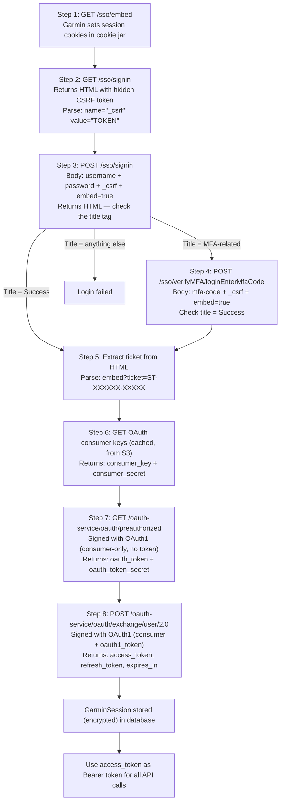
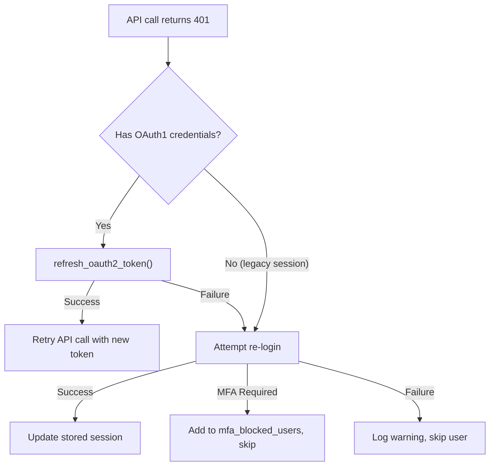
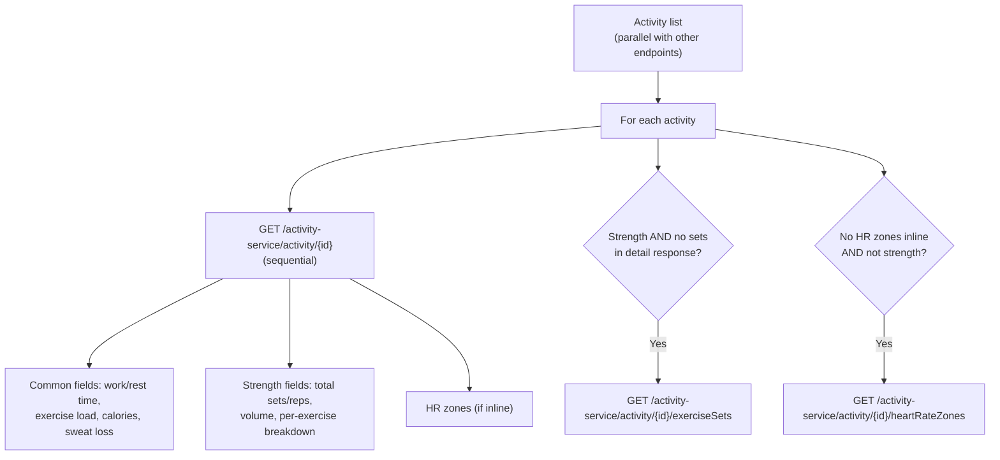
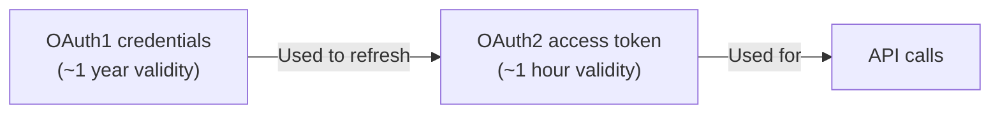

# Reverse-Engineering Garmin Connect Authentication

> *"There is no API. There is only the browser — and whatever the browser does,
> you can do too."*
> — Unofficial motto of web scraping engineers everywhere

This tutorial dissects how Gorilla Coach authenticates with Garmin Connect —
a service that has **no official public API**. We walk through the complete
authentication chain: SSO embed → CSRF extraction → credential submission →
MFA handling → ticket extraction → OAuth1 preauthorization → OAuth2 token
exchange → API access. We also cover token lifecycle management, proactive
refresh, and the background sync worker that keeps data flowing.

---

## Reference Texts

| Abbreviation | Book |
|---|---|
| **PP** | Andrew Hunt & David Thomas — *The Pragmatic Programmer*, 20th Anniversary Ed. (2019) |
| **DDIA** | Martin Kleppmann — *Designing Data-Intensive Applications* (2017) |
| **OWASP** | OWASP Foundation — *OWASP Top 10* (2021) |
| **RFC5849** | E. Hammer-Lahav — *The OAuth 1.0 Protocol* (IETF, 2010) |
| **RFC6749** | D. Hardt — *The OAuth 2.0 Authorization Framework* (IETF, 2012) |
| **ZtP** | Luca Palmieri — *Zero To Production in Rust* (2022) |
| **SRE** | Beyer et al. — *Site Reliability Engineering* (2016) |
| **RiA** | Tim McNamara — *Rust in Action* (2021) |
| **CA** | Robert C. Martin — *Clean Architecture* (2017) |
| **garth** | Matin Tamizi — *garth: Garmin SSO auth + Connect client* (Python, https://github.com/matin/garth) |

---

## Table of Contents

1. [Why Reverse-Engineer Garmin Connect?](#1-why-reverse-engineer)
2. [The Authentication Chain: Bird's-Eye View](#2-the-auth-chain)
3. [Step 1: SSO Embed — Setting Cookies](#3-step-1-sso-embed)
4. [Step 2: SSO Signin — Extracting the CSRF Token](#4-step-2-sso-signin)
5. [Step 3: Credential Submission](#5-step-3-credential-submission)
6. [Step 4: MFA — The Two-Factor Challenge](#6-step-4-mfa)
7. [Step 5: Ticket Extraction — The Golden Token](#7-step-5-ticket-extraction)
8. [Step 6: OAuth Consumer Keys from S3](#8-step-6-oauth-consumer-keys)
9. [Step 7: OAuth1 Preauthorization — Ticket → Token](#9-step-7-oauth1-preauthorization)
10. [Step 8: OAuth1 → OAuth2 Exchange](#10-step-8-oauth1-to-oauth2)
11. [OAuth1 Signature Construction](#11-oauth1-signature-construction)
12. [Token Lifecycle: Expiry, Refresh, and Re-Login](#12-token-lifecycle)
13. [The GarminSession: What Gets Stored](#13-the-garmin-session)
14. [Encryption at Rest: Securing Stored Credentials](#14-encryption-at-rest)
15. [API Access: Making Garmin Connect Calls](#15-api-access)
16. [The 12-Endpoint Parallel Data Fetch](#16-parallel-data-fetch)
17. [Activity Enrichment: Sub-Requests for Detail](#17-activity-enrichment)
18. [Rate Limiting and Error Handling](#18-rate-limiting)
19. [Background Sync Worker](#19-background-sync)
20. [The Regex Helpers: Parsing HTML with Pattern Matching](#20-regex-helpers)
21. [Retry Logic and Network Resilience](#21-retry-logic)
22. [Login Result: The Three Outcomes](#22-login-result)
23. [Further Reading](#23-further-reading)

---

## 1. Why Reverse-Engineer Garmin Connect?

Garmin Connect has no public API. Unlike Fitbit (Google), Apple Health, or
Strava — all of which offer official OAuth-based developer APIs — Garmin's
Connect platform only provides:

1. **Garmin Health API**: A B2B enterprise API for companies to receive
   push notifications of user data. Requires a business partnership agreement,
   NDA, and is not available to individual developers.

2. **Garmin Connect IQ**: An API for watch face and widget development — not
   for accessing health data from a server.

3. **The Garmin Connect Website and Mobile App**: These both use internal
   REST endpoints authenticated via SSO. If you reverse-engineer the auth
   flow, you can call the same endpoints the app calls.

The Python `garth` library (by Matin Tamizi) reverse-engineered this flow
and has become the de facto standard for unofficial Garmin authentication.
Gorilla Coach's `garmin.rs` is a Rust implementation of the same flow, with
MFA support, token refresh, error classification, and parallel API fetching.

> **PP**, Tip 15: *"Every Piece of Knowledge Must Have a Single, Unambiguous,
> Authoritative Representation Within a System."* The authoritative
> representation of the Garmin auth flow is garth — we follow its conventions
> rather than inventing our own.

---

## 2. The Authentication Chain: Bird's-Eye View



The entire flow takes 5-8 HTTP requests (depending on MFA) and produces an
OAuth2 Bearer token valid for about 1 hour. The OAuth1 credentials (token +
secret from Step 7) remain valid for approximately 1 year and are used to
refresh the OAuth2 token without re-authenticating.

---

## 3. Step 1: SSO Embed — Setting Cookies

The first request primes Garmin's SSO server by loading the embed widget page.
This sets session cookies that subsequent requests need:

```rust
const SSO_BASE: &str = "https://sso.garmin.com/sso";

let embed_url = format!("{}/embed", SSO_BASE);
let embed_params: Vec<(&str, &str)> = vec![
    ("id", "gauth-widget"),
    ("embedWidget", "true"),
    ("gauthHost", SSO_BASE),
];

get_with_retry(&client, &embed_url, &embed_params).await?;
```

The response body is ignored. What matters are the **cookies** that Garmin's
SSO server sets. The `reqwest::Client` has `cookie_store(true)`, so cookies
are automatically captured and sent on subsequent requests.

### Client Construction

The SSO client is built with specific requirements:

```rust
fn build_sso_client() -> Result<Client, String> {
    Client::builder()
        .cookie_store(true)         // Auto-manage cookies
        .user_agent(USER_AGENT)     // Pretend to be the Android app
        .redirect(Policy::limited(10))  // Follow redirects (up to 10)
        .connect_timeout(Duration::from_secs(30))
        .timeout(Duration::from_secs(60))
        .build()
}
```

The `USER_AGENT` is set to `"com.garmin.android.apps.connectmobile"` — the
Garmin Connect Mobile app's user agent. This is important: Garmin's SSO server
may serve different pages or reject requests based on the user agent.

---

## 4. Step 2: SSO Signin — Extracting the CSRF Token

The signin page contains a hidden form field with a CSRF token. We need to
extract this token to include in the credential submission:

```rust
let signin_url = format!("{}/signin", SSO_BASE);
let signin_resp = client
    .get(&signin_url)
    .query(&signin_params())
    .header("Referer", &embed_url)
    .send().await?;

let signin_html = signin_resp.text().await?;
let csrf_token = extract_csrf(&signin_html)?;
```

The CSRF token is extracted via regex:

```rust
static RE_CSRF: LazyLock<regex::Regex> = LazyLock::new(|| {
    regex::Regex::new(r#"name="_csrf"\s+value="([^"]+)""#).unwrap()
});

fn extract_csrf(html: &str) -> Option<String> {
    RE_CSRF.captures(html).map(|c| c[1].to_string())
}
```

Notice: `LazyLock` (Rust's built-in static initializer) ensures the regex is
compiled exactly once. This is a performance pattern — regex compilation is
expensive, and these patterns are used repeatedly across login attempts.

The signin parameters include the embed URL as both the `service` and `source`
— telling Garmin's SSO that this is an embedded widget login, not a full
website login:

```rust
fn signin_params() -> Vec<(&'static str, String)> {
    let sso_embed = format!("{}/embed", SSO_BASE);
    vec![
        ("id", "gauth-widget".to_string()),
        ("embedWidget", "true".to_string()),
        ("gauthHost", sso_embed.clone()),
        ("service", sso_embed.clone()),
        ("source", sso_embed.clone()),
        ("redirectAfterAccountLoginUrl", sso_embed.clone()),
        ("redirectAfterAccountCreationUrl", sso_embed),
    ]
}
```

---

## 5. Step 3: Credential Submission

With the CSRF token in hand, we POST the user's credentials:

```rust
let mut form_data = HashMap::new();
form_data.insert("username", email.to_string());
form_data.insert("password", password.to_string());
form_data.insert("embed", "true".to_string());
form_data.insert("_csrf", csrf_token.clone());

let signin_post_resp = client
    .post(&signin_url)
    .query(&signin_params())
    .header("Referer", &signin_url)
    .form(&form_data)
    .send().await?;
```

The response is an HTML page. We check the `<title>` tag to determine the
outcome:

```rust
let title = extract_title(&resp_html).unwrap_or_default();

if is_mfa_title(&title) || is_mfa_page(&resp_html) {
    return LoginResult::MfaRequired { ... };
}

if title != "Success" {
    return LoginResult::Error(...);
}
```

Three possible outcomes:

| `<title>` | Meaning | Action |
|---|---|---|
| `"Success"` | Credentials accepted | Extract ticket (Step 5) |
| MFA-related title | 2FA required | Return `MfaRequired` |
| Anything else | Login failed | Return `Error` |

---

## 6. Step 4: MFA — The Two-Factor Challenge

If Garmin requires MFA (Multi-Factor Authentication), the login result is
`MfaRequired`. The MFA page detection uses both the page title AND body content:

```rust
fn is_mfa_page(html: &str) -> bool {
    let lower = html.to_lowercase();
    lower.contains("verification-code") || lower.contains("mfa-code")
        || lower.contains("verificationcode") || lower.contains("id=\"mfa")
        || (lower.contains("verify") && lower.contains("code"))
}

fn is_mfa_title(title: &str) -> bool {
    let lower = title.to_lowercase();
    lower.contains("mfa") || lower.contains("authentication application")
        || lower.contains("verification") || lower.contains("two-factor")
        || lower.contains("2fa")
}
```

Why check both? Because Garmin changes their SSO pages without notice. The
title might change while the form body stays the same, or vice versa. Defense
in depth.

### MFA Submission

When the user enters their 6-digit MFA code, `garmin_submit_mfa()` replays
the entire login flow from scratch (embed → signin → credentials → MFA submit):

```rust
pub async fn garmin_submit_mfa(
    email: &str,
    password: &str,
    mfa_code: &str,
) -> LoginResult {
    let client = build_sso_client()?;

    // Re-do the full login flow up to MFA
    // (embed → signin GET → signin POST → detect MFA page)

    // Submit MFA code
    let mfa_url = format!("{}/verifyMFA/loginEnterMfaCode", SSO_BASE);
    let mut mfa_form = HashMap::new();
    mfa_form.insert("mfa-code", mfa_code.to_string());
    mfa_form.insert("embed", "true".to_string());
    mfa_form.insert("_csrf", mfa_csrf);
    mfa_form.insert("fromPage", "setupEnterMfaCode".to_string());

    let mfa_resp = client.post(&mfa_url)
        .query(&signin_params())
        .form(&mfa_form)
        .send().await?;

    // Check for Success title, then complete_login()
}
```

Why replay the entire flow? Because each SSO session has its own cookie jar.
The cookies from the original login attempt are in a different
`reqwest::Client` that we can't persist between requests. So we start fresh
and walk through the same steps, ending with the MFA submission.

The MFA code is validated server-side:

```rust
if input.mfa_code.len() != 6 || !input.mfa_code.chars().all(|c| c.is_numeric()) {
    return Html("❌ Invalid MFA code. Must be 6 digits.").into_response();
}
```

### MFA and Background Sync

MFA creates a problem for automatic background sync. If a user's token expires
and Garmin requires MFA to re-authenticate, the background worker can't provide
an MFA code. Gorilla Coach handles this by **blocking** the user from background
sync until they manually submit their MFA code:

```rust
// In sync worker:
let metrics = bg_state.metrics.lock();
if metrics.mfa_blocked_users.contains(&user_id) {
    continue;  // Skip this user
}
```

When MFA is verified, the block is lifted:

```rust
metrics.mfa_blocked_users.remove(&user_id);
```

---

## 7. Step 5: Ticket Extraction — The Golden Token

If the login succeeds (title = "Success"), the response HTML contains a
redirect URL with a service ticket — a one-time-use token:

```html
<script>
    window.location.href = "https://sso.garmin.com/sso/embed?ticket=ST-12345-abcdef"
</script>
```

We extract this ticket via regex:

```rust
static RE_TICKET: LazyLock<regex::Regex> = LazyLock::new(|| {
    regex::Regex::new(r#"embed\?ticket=([^"]+)"#).unwrap()
});

fn extract_ticket(html: &str) -> Option<String> {
    RE_TICKET.captures(html).map(|c| c[1].to_string())
}
```

This ticket is the bridge between the web SSO flow and the OAuth flow. It
proves that the user authenticated successfully, and it can be exchanged
(exactly once) for OAuth tokens.

> **RFC6749**, Section 4.1: *"The authorization code provides a few important
> security benefits, such as the ability to authenticate the client, as well as
> the transmission of the access token directly to the client without passing
> it through the resource owner's user-agent."*

The ticket serves the same role as an authorization code in standard OAuth 2.0
— but in Garmin's proprietary SSO flow.

---

## 8. Step 6: OAuth Consumer Keys from S3

Before making OAuth1-signed requests, we need consumer credentials (app-level
keys). Garmin stores these publicly on S3:

```rust
const OAUTH_CONSUMER_URL: &str =
    "https://thegarth.s3.amazonaws.com/oauth_consumer.json";

static OAUTH_CONSUMER: tokio::sync::OnceCell<OAuthConsumer> =
    tokio::sync::OnceCell::const_new();

async fn get_oauth_consumer(client: &Client) -> Result<&'static OAuthConsumer, String> {
    OAUTH_CONSUMER.get_or_try_init(|| async {
        client.get(OAUTH_CONSUMER_URL)
            .send().await?
            .json().await?
    }).await
}
```

The `OnceCell` ensures these keys are fetched exactly once and cached for the
lifetime of the process. The S3 URL is the same one used by the `garth` Python
library.

```json
{
    "consumer_key": "fc3e99d2-...",
    "consumer_secret": "E08WAR897..."
}
```

---

## 9. Step 7: OAuth1 Preauthorization — Ticket → Token

This step exchanges the one-time SSO ticket for OAuth1 credentials. The request
is signed with OAuth1 (consumer-only, no token yet):

```rust
let preauth_base_url = format!(
    "{}/oauth-service/oauth/preauthorized", CONNECT_API
);

let query_params = vec![
    ("ticket", ticket.as_str()),
    ("login-url", login_url.as_str()),
    ("accepts-mfa-tokens", "true"),
];

let preauth_auth = build_oauth1_header_with_params(
    "GET",
    &preauth_base_url,
    &consumer.consumer_key,
    &consumer.consumer_secret,
    "",  // no token yet
    "",  // no token secret yet
    &timestamp,
    &nonce,
    &query_params,  // included in signature
);

let preauth_resp = client
    .get(&preauth_base_url)
    .query(&query_params)
    .header("Authorization", &preauth_auth)
    .send().await?;
```

The response is URL-encoded:

```
oauth_token=abc123&oauth_token_secret=xyz789&mfa_token=opt456
```

We parse this into a `HashMap`:

```rust
let oauth1_params: HashMap<String, String> =
    url::form_urlencoded::parse(preauth_body.as_bytes())
        .map(|(k, v)| (k.to_string(), v.to_string()))
        .collect();

let oauth1_token = oauth1_params.get("oauth_token")?;
let oauth1_secret = oauth1_params.get("oauth_token_secret")?;
let mfa_token = oauth1_params.get("mfa_token").cloned();
```

These OAuth1 credentials are **long-lived** (~1 year) and are stored alongside
the OAuth2 token. They're needed for token refresh.

---

## 10. Step 8: OAuth1 → OAuth2 Exchange

The final step exchanges the OAuth1 token for an OAuth2 Bearer token:

```rust
let exchange_url = format!(
    "{}/oauth-service/oauth/exchange/user/2.0", CONNECT_API
);

let auth_header = build_oauth1_header_with_params(
    "POST",
    &exchange_url,
    &consumer.consumer_key,
    &consumer.consumer_secret,
    &oauth1_token,
    &oauth1_secret,
    &timestamp,
    &nonce,
    &exchange_params,  // may include mfa_token
);

let exchange_resp = client
    .post(&exchange_url)
    .header("Authorization", &auth_header)
    .form(&exchange_form)  // may include mfa_token in body
    .send().await?;
```

The response is JSON:

```json
{
    "access_token": "eyJhbGciOiJSUzI1NiJ9...",
    "token_type": "Bearer",
    "expires_in": 3600,
    "refresh_token": "..."
}
```

This OAuth2 token is stored as a `GarminSession`:

```rust
LoginResult::Success(GarminSession {
    oauth2: token,
    oauth1_token: oauth1_token.clone(),
    oauth1_token_secret: oauth1_secret.clone(),
    oauth2_created_at: chrono::Utc::now().timestamp(),
})
```

---

## 11. OAuth1 Signature Construction

The OAuth1 signature is the most complex piece of the auth flow. It implements
RFC 5849 (OAuth 1.0 Protocol) with HMAC-SHA1 signing.

### The Algorithm

```
1. Collect all parameters:
   - OAuth protocol params (consumer_key, nonce, signature_method, timestamp, version)
   - OAuth token (if present)
   - Extra params (query string and/or form body)

2. Sort parameters alphabetically by key

3. URL-encode keys and values, join with = and &:
   "oauth_consumer_key=KEY&oauth_nonce=NONCE&...&ticket=ST-XXX"

4. Build the signature base string:
   "METHOD&URL_ENCODED_URL&URL_ENCODED_PARAM_STRING"

5. Build the signing key:
   "URL_ENCODED_CONSUMER_SECRET&URL_ENCODED_TOKEN_SECRET"

6. HMAC-SHA1(signing_key, base_string)

7. Base64-encode the result → that's the signature
```

### The Implementation

```rust
fn build_oauth1_header_with_params(
    method: &str, url: &str,
    consumer_key: &str, consumer_secret: &str,
    token: &str, token_secret: &str,
    timestamp: &str, nonce: &str,
    extra_params: &[(&str, &str)],
) -> String {
    // 1. Collect params
    let mut params: Vec<(&str, &str)> = vec![
        ("oauth_consumer_key", consumer_key),
        ("oauth_nonce", nonce),
        ("oauth_signature_method", "HMAC-SHA1"),
        ("oauth_timestamp", timestamp),
        ("oauth_version", "1.0"),
    ];
    if !token.is_empty() {
        params.push(("oauth_token", token));
    }
    for &(k, v) in extra_params {
        params.push((k, v));
    }

    // 2. Sort
    params.sort_by_key(|&(k, _)| k);

    // 3. Encode and join
    let param_string: String = params.iter()
        .map(|(k, v)| format!("{}={}", percent_encode(k), percent_encode(v)))
        .collect::<Vec<_>>()
        .join("&");

    // 4. Base string
    let base_string = format!(
        "{}&{}&{}",
        method.to_uppercase(),
        percent_encode(url),
        percent_encode(&param_string)
    );

    // 5. Signing key
    let signing_key = format!(
        "{}&{}",
        percent_encode(consumer_secret),
        percent_encode(token_secret)
    );

    // 6. HMAC-SHA1
    let mut mac = HmacSha1::new_from_slice(signing_key.as_bytes()).unwrap();
    mac.update(base_string.as_bytes());
    let signature = BASE64_STANDARD.encode(mac.finalize().into_bytes());

    // 7. Build Authorization header
    format!(
        r#"OAuth oauth_consumer_key="{}", oauth_nonce="{}", oauth_signature="{}", ..."#,
        percent_encode(consumer_key),
        percent_encode(nonce),
        percent_encode(&signature),
        // ...
    )
}
```

The critical detail is that **extra parameters (query string and form body)
must be included in the signature base string**. This is per RFC 5849 §3.4.1.3 —
"The request parameters are collected, sorted, encoded, and concatenated into a single string."

The percent encoding is also per spec (RFC 5849 §3.6): only unreserved
characters (`A-Z a-z 0-9 - . _ ~`) pass through unencoded. Everything else
becomes `%XX`.

---

## 12. Token Lifecycle: Expiry, Refresh, and Re-Login

Garmin's token lifecycle has two tiers:

| Token | Lifetime | Use |
|---|---|---|
| OAuth2 access token | ~1 hour | Bearer auth for API calls |
| OAuth1 token + secret | ~1 year | Signing token refresh requests |

### Proactive Refresh (garth-style)

Before every API call, the sync worker checks if the OAuth2 token is expired:

```rust
impl GarminSession {
    pub fn is_oauth2_expired(&self) -> bool {
        if self.oauth2_created_at == 0 {
            return false; // unknown creation time, let API discover 401
        }
        let now = chrono::Utc::now().timestamp();
        let expires_at = self.oauth2_created_at + self.oauth2.expires_in;
        now >= (expires_at - 60) // refresh 60s before actual expiry
    }
}
```

The 60-second buffer ensures we refresh before the token actually expires,
avoiding 401 errors during API calls.

### Refresh Flow

Token refresh reuses the OAuth1 credentials — no SSO re-login needed:

```rust
pub async fn refresh_oauth2_token(
    client: &Client,
    session: &GarminSession,
) -> Result<GarminSession, String> {
    let consumer = get_oauth_consumer(client).await?;

    let auth_header = build_oauth1_header_with_params(
        "POST", &exchange_url,
        &consumer.consumer_key, &consumer.consumer_secret,
        &session.oauth1_token, &session.oauth1_token_secret,
        &timestamp, &nonce, &[],
    );

    let resp = client.post(&exchange_url)
        .header("Authorization", &auth_header)
        .send().await?;

    // Returns a new OAuth2 token; OAuth1 creds remain unchanged
    Ok(GarminSession {
        oauth2: new_token,
        oauth1_token: session.oauth1_token.clone(),
        oauth1_token_secret: session.oauth1_token_secret.clone(),
        oauth2_created_at: chrono::Utc::now().timestamp(),
    })
}
```

### Fallback Chain

The sync worker handles token failures with a cascading fallback:



---

## 13. The GarminSession: What Gets Stored

```rust
pub struct GarminSession {
    pub oauth2: GarminOAuth2Token,    // access_token, refresh_token, expires_in
    pub oauth1_token: String,          // for signing refresh requests
    pub oauth1_token_secret: String,   // for signing refresh requests
    pub oauth2_created_at: i64,        // unix timestamp for proactive expiry
}
```

The entire `GarminSession` is serialized to JSON and encrypted before storage:

```rust
let token_json = serde_json::to_string(&token).unwrap_or_default();
let (encrypted, nonce) = vault.encrypt(&token_json);
state.repo.save_garmin_token(user_id, &encrypted, &nonce).await;
```

---

## 14. Encryption at Rest: Securing Stored Credentials

All Garmin credentials are encrypted at rest via ChaCha20-Poly1305:

| Field | Encryption |
|---|---|
| Garmin password | Encrypted with vault, stored as `encrypted_garmin_password` + `nonce` |
| GarminSession (entire JSON) | Encrypted with vault, stored as `garmin_oauth_token` + `garmin_oauth_token_nonce` |

The vault uses a `MASTER_KEY` from environment variables. If the master key
changes, all stored credentials become unreadable — this is a security
feature, not a bug. It means a database dump is worthless without the key.

> **OWASP**, A02:2021 — Cryptographic Failures: *"Data in transit and at rest
> must be encrypted with modern, well-configured cryptography."*

---

## 15. API Access: Making Garmin Connect Calls

Once authenticated, API calls use the OAuth2 Bearer token:

```rust
pub async fn garmin_api(
    client: &Client,
    access_token: &str,
    path: &str,
    params: &[(&str, &str)],
) -> Result<serde_json::Value, GarminApiError> {
    let url = format!("{}{}", CONNECT_API, path);
    let resp = client
        .get(&url)
        .bearer_auth(access_token)
        .header("User-Agent", USER_AGENT)
        .query(params)
        .send().await?;

    if !resp.status().is_success() {
        return Err(match status.as_u16() {
            429 => GarminApiError::RateLimited,
            401 => GarminApiError::AuthFailed,
            code if code >= 500 => GarminApiError::ServerError(code),
            _ => GarminApiError::Other(...),
        });
    }

    resp.json().await
}
```

The `GarminApiError` enum enables callers to react appropriately:

```rust
pub enum GarminApiError {
    RateLimited,        // 429 — stop ALL requests immediately
    ServerError(u16),   // 500+ — transient, may retry
    AuthFailed,         // 401 — token expired, refresh needed
    Other(String),      // network, parse, etc.
}
```

---

## 16. The 12-Endpoint Parallel Data Fetch

For each day of data, Gorilla Coach hits 12 different Garmin Connect API
endpoints simultaneously via `tokio::join!`:

```rust
let (
    summary_res, hr_res, hrv_res, sleep_res, stress_res, bb_res,
    weight_res, spo2_res, resp_res, tr_res, ts_res, acts_res,
) = tokio::join!(
    garmin_api_with_params(client, token, &summary_path, &summary_params),
    garmin_api_with_params(client, token, &hr_path, &hr_params),
    garmin_connect_api(client, token, &hrv_path),
    garmin_api_with_params(client, token, &sleep_path, &sleep_params),
    garmin_connect_api(client, token, &stress_path),
    garmin_api_with_params(client, token, bb_path, &bb_params),
    garmin_api_with_params(client, token, weight_path, &weight_params),
    garmin_connect_api(client, token, &spo2_path),
    garmin_connect_api(client, token, &resp_path),
    garmin_connect_api(client, token, &tr_path),
    garmin_connect_api(client, token, &ts_path),
    garmin_api_with_params(client, token, acts_path, &acts_params),
);
```

| # | Endpoint | Data |
|---|---|---|
| 1 | `/usersummary-service/usersummary/daily/{name}` | Steps, calories, floors, bb, SpO2 |
| 2 | `/wellness-service/wellness/dailyHeartRate/{name}` | Resting/max/min/avg HR |
| 3 | `/hrv-service/hrv/{date}` | HRV weekly avg, last night |
| 4 | `/wellness-service/wellness/dailySleepData/{name}` | Sleep score, stages, overnight HR |
| 5 | `/wellness-service/wellness/dailyStress/{date}` | Avg/max stress |
| 6 | `/wellness-service/wellness/bodyBattery/reports/daily` | BB high/low/charge/drain |
| 7 | `/weight-service/weight/dateRange` | Weight, BMI, body fat, muscle mass |
| 8 | `/wellness-service/wellness/daily/spo2/{date}` | SpO2 avg/lowest |
| 9 | `/wellness-service/wellness/daily/respiration/{date}` | Avg respiration |
| 10 | `/metrics-service/metrics/trainingreadiness/{date}` | Training readiness score |
| 11 | `/metrics-service/metrics/trainingstatus/aggregated/{date}` | VO2 max, training load |
| 12 | `/activitylist-service/activities/search/activities` | Activities list for the day |

Each endpoint is parsed independently — if one fails, the others still
populate their respective fields. After all 12 complete, we check if any
returned 429:

```rust
for res in [&summary_res, &hr_res, ...] {
    if was_rate_limited(res) { rate_limited = true; break; }
}
```

If any endpoint was rate-limited, the caller is told to stop syncing
immediately.

---

## 17. Activity Enrichment: Sub-Requests for Detail

The activity list (endpoint 12) returns basic summary data. For each activity,
a sub-request to `/activity-service/activity/{id}` fetches the full detail:



Sub-requests run **sequentially** (not in parallel) because:
1. They're within the activity loop, which is already inside the parallel daily fetch
2. Each activity might trigger 1-3 sub-requests — parallelizing could cause rate limiting
3. The sub-requests short-circuit on 429 (stop immediately)

---

## 18. Rate Limiting and Error Handling

Garmin's Connect API enforces rate limits aggressively. Gorilla Coach's
stance: **any 429 means STOP EVERYTHING**.

```rust
// If any result was rate-limited, set the flag
for res in [&summary_res, ...] {
    if matches!(res, Err(GarminApiError::RateLimited)) {
        rate_limited = true;
        break;
    }
}

// Sub-requests check before proceeding
if activity_id > 0 && !rate_limited {
    // ... make sub-request ...
    Err(GarminApiError::RateLimited) => { rate_limited = true; }
}
```

The `rate_limited` flag is propagated to the caller via the return value:

```rust
pub async fn fetch_all_daily_data(...) -> (GarminDailyData, bool) {
    // ...
    (data, rate_limited)
}
```

If `rate_limited` is true, the sync worker stops syncing further dates for
this user.

---

## 19. Background Sync Worker

The background sync is a `tokio::spawn` task in `main.rs`:

```rust
tokio::spawn(async move {
    tokio::time::sleep(Duration::from_secs(30)).await;  // startup delay
    let mut interval = tokio::time::interval(Duration::from_secs(60 * 60));
    interval.tick().await;  // consume initial tick
    loop {
        interval.tick().await;
        // For each user with Garmin credentials:
        //   - Skip MFA-blocked users
        //   - Call perform_user_sync()
    }
});
```

The sync worker:
1. Waits 30 seconds after server startup (avoid competing with initialization)
2. Runs every hour
3. Iterates over all users with stored Garmin credentials
4. Skips users blocked by MFA
5. Calls `perform_user_sync()` which handles the full proactive-refresh →
   multi-day-fetch → upsert pipeline

---

## 20. The Regex Helpers: Parsing HTML with Pattern Matching

Three pre-compiled regex patterns are used throughout the auth flow:

```rust
// Extract CSRF token: name="_csrf" value="..."
static RE_CSRF: LazyLock<regex::Regex> = LazyLock::new(|| {
    regex::Regex::new(r#"name="_csrf"\s+value="([^"]+)""#).unwrap()
});

// Extract page title: <title>...</title>
static RE_TITLE: LazyLock<regex::Regex> = LazyLock::new(|| {
    regex::Regex::new(r"<title>([^<]+)</title>").unwrap()
});

// Extract ticket: embed?ticket=...
static RE_TICKET: LazyLock<regex::Regex> = LazyLock::new(|| {
    regex::Regex::new(r#"embed\?ticket=([^"]+)"#).unwrap()
});
```

Why regex instead of an HTML parser? Because we're extracting exactly 3
pieces of information from Garmin's HTML, and they follow predictable patterns.
A full HTML parser (e.g., `scraper`, `select.rs`) would add a dependency for
3 captures.

> **PP**, Tip 34: *"Use Tracer Bullets."* The regex approach is a tracer
> bullet — minimal, targeted, and verifiable. If Garmin changes their HTML
> structure, we'll know immediately (the regex will fail to match) and can
> update the pattern.

---

## 21. Retry Logic and Network Resilience

The SSO embed request (Step 1) uses a retry wrapper for network resilience:

```rust
async fn get_with_retry(
    client: &Client,
    url: &str,
    query: &[(&str, &str)],
) -> Result<reqwest::Response, String> {
    let mut last_err = String::new();
    for attempt in 1..=3 {
        match client.get(url).query(query).send().await {
            Ok(resp) => return Ok(resp),
            Err(e) => {
                last_err = format!("{}", e);
                tracing::warn!("Request to {} failed (attempt {}/3): {}",
                    url, attempt, last_err);
                if attempt < 3 {
                    tokio::time::sleep(Duration::from_secs(2)).await;
                }
            }
        }
    }
    Err(last_err)
}
```

This retry logic is intentionally limited to the SSO embed request. The
rationale:
- **SSO embed**: On a home server, DNS resolution can be flaky after sleep.
  The first request often fails, the second succeeds. 3 retries with 2-second
  delays handle this.
- **All other requests**: Use reqwest's built-in timeout. If they fail, it's
  not a DNS issue — it's a real error.

---

## 22. Login Result: The Three Outcomes

The `LoginResult` enum captures every possible outcome of the auth flow:

```rust
pub enum LoginResult {
    Success(GarminSession),
    MfaRequired { csrf_token: String, cookies: String },
    Error(String),
}
```

| Variant | Cause | Handler Action |
|---|---|---|
| `Success` | Login + OAuth complete | Encrypt and store session, enable sync |
| `MfaRequired` | Garmin 2FA enabled | Show MFA input form, block background sync |
| `Error` | Wrong password, network, SSO change | Show error message to user |

The `MfaRequired` variant carries the CSRF token for the MFA form. The
`cookies` field exists for forward compatibility but is currently empty
because the cookie jar lives in the ephemeral `reqwest::Client`.

---

## Day-2 Operations: Garmin Auth Troubleshooting

### Diagnosing Sync Failures

The background sync logs are your first source of truth. Key log patterns and
what they mean:

| Log Message | Meaning | Action |
|---|---|---|
| `garmin API /userprofile-service returned 401` | Access token expired | Automatic — system attempts OAuth1 refresh |
| `No OAuth1 credentials (legacy session)` | Old session format without refresh capability | Re-authenticate via Settings page |
| `garmin_login: MFA/authentication page detected` | Full re-login triggered Garmin 2FA | Enter MFA code in Settings, or clear stale credentials |
| `garmin API {endpoint} rate limited (429)` | Too many requests to Garmin | Wait — sync will resume next hour. Check `GARMIN_API_DELAY_SECS` |
| `SSO embed request failed` | DNS/network failure to Garmin SSO | Check internet connectivity. Retried 3× with 2s delay automatically |
| `Could not find CSRF token in signin page` | Garmin changed their SSO HTML | SSO scraping is broken — code update needed |
| `Failed to fetch OAuth consumer` | Can't reach S3 for OAuth consumer keys | Network issue or Garmin moved the consumer key endpoint |
| `Could not decrypt OAuth token. Check MASTER_KEY.` | MASTER_KEY changed since credentials were stored | Re-enter Garmin credentials in Settings with the current key |

### Token Lifecycle Management

The Garmin session has two layers of tokens with different lifespans:



**Healthy flow**: OAuth2 expires → auto-refreshed via OAuth1 → API calls resume.

**Degraded flow**: OAuth2 expires → OAuth1 refresh fails → full re-login
attempted → MFA triggered → sync blocked until user enters MFA code.

**Legacy flow** (pre-OAuth1 storage): OAuth2 expires → no OAuth1 creds → full
re-login → MFA → user intervention required.

### Clearing Stale Garmin Sessions

If the sync keeps hitting MFA and you can't enter the code (e.g., the user
account is a test account), clear the stored credentials to stop the sync from
trying:

```sql
UPDATE user_settings
SET garmin_username = NULL,
    encrypted_garmin_password = NULL,
    nonce = NULL,
    garmin_oauth_token = NULL,
    garmin_oauth_token_nonce = NULL,
    last_sync_at = NULL
WHERE user_id = '<USER_ID>';
```

The background sync skips users without stored OAuth tokens.

### Resetting MFA State

If the MFA challenge is stuck (expired code, UI glitch):

```sql
UPDATE user_settings
SET mfa_challenge_required = FALSE,
    mfa_challenge_code = NULL,
    mfa_challenge_expires_at = NULL
WHERE user_id = '<USER_ID>';
```

Then re-authenticate from Settings.

### Garmin SSO Breaks (It Will)

Garmin's SSO is undocumented and changes without notice. Signs that the SSO
flow has changed:

- `Could not find CSRF token in signin page` — the HTML structure changed
- `Login failed. Garmin SSO returned: '{unexpected_title}'` — a new page
  appeared in the flow
- Successful login but all API calls return 401 — the OAuth exchange changed

When this happens:
1. Check the Python `garth` library for recent commits — they track the same
   flow and typically adapt within days
2. Use `RUST_LOG=gorilla_coach::garmin=debug` to see the full HTML responses
3. Compare the response HTML to the regex patterns in `garmin.rs`

### Background Sync Tuning

Environment variables that control sync behavior:

| Variable | Default | Purpose |
|---|---|---|
| `SYNC_RATE_LIMIT_MINS` | 60 | Minimum minutes between sync runs per user |
| `SYNC_DAYS` | 30 | How many days of history to sync |
| `GARMIN_API_DELAY_SECS` | 5 | Delay between API calls for each day |
| `MAX_CONSECUTIVE_EMPTY_DAYS` | 5 | Stop syncing after N consecutive days with no data |

For debugging, reduce `SYNC_DAYS` to 2 and `SYNC_RATE_LIMIT_MINS` to 1.

### Forcing a Re-Sync

To force re-sync of a specific date, reset its `synced_at` timestamp:

```sql
UPDATE garmin_daily_data
SET synced_at = '2000-01-01T00:00:00Z'
WHERE user_id = '<USER_ID>' AND date = '2026-02-20';
```

The sync worker skips dates that were synced within the rate limit window.
Setting `synced_at` to an old timestamp bypasses this check.

---

## 23. Further Reading

- garth library (Python reference implementation): https://github.com/matin/garth
- RFC 5849 — OAuth 1.0 Protocol: https://tools.ietf.org/html/rfc5849
- RFC 6749 — OAuth 2.0 Framework: https://tools.ietf.org/html/rfc6749
- Garmin Connect reverse-engineering: https://github.com/cyberjunky/python-garminconnect
- OWASP Authentication Cheat Sheet: https://cheatsheetseries.owasp.org/cheatsheets/Authentication_Cheat_Sheet.html
- reqwest cookie store: https://docs.rs/reqwest/latest/reqwest/struct.ClientBuilder.html#method.cookie_store
