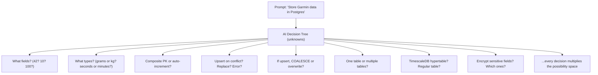
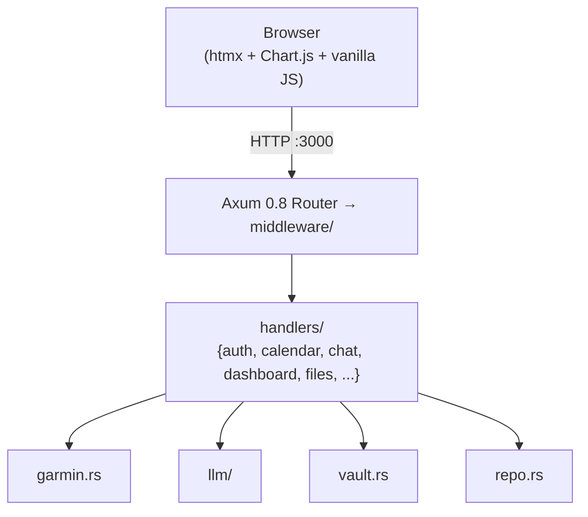
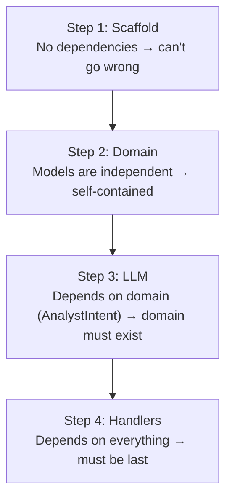
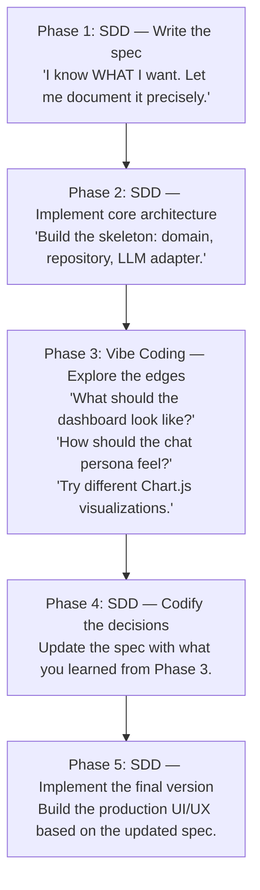
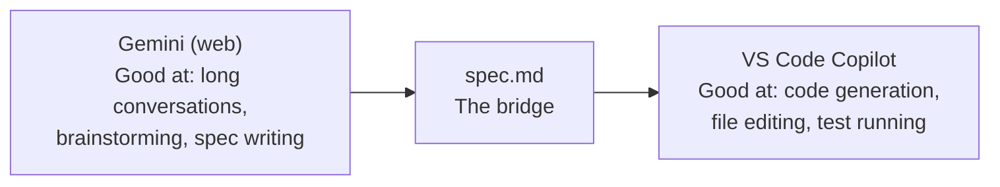

# Spec-Driven Development: Building Software from a Blueprint

> *"Weeks of coding can save you hours of planning."*
> — Unknown (widely attributed)

This tutorial explains **Spec-Driven Development (SDD)** — the practice of
writing a detailed specification before writing any code, then using that
spec to guide an AI coding agent through implementation. We contrast SDD with
"vibe coding" (prompt-and-pray), show how to combine both for accelerated
learning, and walk through concrete examples using Gorilla Coach's own
`spec.md` as the reference artifact.

---

## Reference Texts

| Abbreviation | Book |
|---|---|
| **PP** | Andrew Hunt & David Thomas — *The Pragmatic Programmer*, 20th Anniversary Ed. (2019) |
| **DDIA** | Martin Kleppmann — *Designing Data-Intensive Applications* (2017) |
| **CA** | Robert C. Martin — *Clean Architecture* (2017) |
| **DDD** | Eric Evans — *Domain-Driven Design* (2003) |
| **Mythical** | Frederick P. Brooks Jr. — *The Mythical Man-Month*, Anniversary Ed. (1995) |
| **YNAB** | Kent Beck — *Test-Driven Development: By Example* (2002) |
| **Shape** | Ryan Singer — *Shape Up: Stop Running in Circles and Ship Work that Matters* (2019) |
| **ZtP** | Luca Palmieri — *Zero To Production in Rust* (2022) |

---

## Table of Contents

1. [What Is Spec-Driven Development?](#1-what-is-sdd)
2. [What Is Vibe Coding?](#2-what-is-vibe-coding)
3. [Why SDD Exists: The Cost of Ambiguity](#3-why-sdd-exists)
4. [The Spec Document: Anatomy and Purpose](#4-the-spec-document)
5. [Section 1: Context & Goal — The "Why"](#5-section-1-context-and-goal)
6. [Section 2: Architecture & Tech Stack — The "How"](#6-section-2-architecture)
7. [Section 3: Domain Model — The "What"](#7-section-3-domain-model)
8. [Section 4: Core Features — The "Requirements"](#8-section-4-core-features)
9. [Section 5: Out of Scope — The "Anti-Goals"](#9-section-5-out-of-scope)
10. [Section 6: Execution Plan — The "Sequence"](#10-section-6-execution-plan)
11. [SDD vs Vibe Coding: A Comparison](#11-sdd-vs-vibe-coding)
12. [When Vibe Coding Works](#12-when-vibe-coding-works)
13. [When SDD Is Essential](#13-when-sdd-is-essential)
14. [SDD + Vibe Coding: The Hybrid Approach](#14-hybrid-approach)
15. [Workflow: Gemini + VS Code + Copilot](#15-workflow-gemini-vscode)
16. [Writing the Spec: A Step-by-Step Guide](#16-writing-the-spec)
17. [Using the Spec to Drive AI Implementation](#17-driving-ai-implementation)
18. [SDD as a Learning Accelerator](#18-learning-accelerator)
19. [Common Anti-Patterns and How to Avoid Them](#19-anti-patterns)
20. [Further Reading](#20-further-reading)

---

## 1. What Is Spec-Driven Development?

Spec-Driven Development is the practice of writing a comprehensive project
specification **before** writing any implementation code, then using that
specification as the authoritative guide for all implementation decisions.

The spec is not a napkin sketch. It is a **machine-readable contract** that
defines:
- What the system does (features)
- What the system is built from (architecture, libraries)
- What the data looks like (domain model)
- What the system must NOT do (anti-goals)
- In what order to build it (execution plan)

In the context of AI-assisted development, the spec becomes the **system
prompt for your codebase**. When you paste the spec into Gemini, Claude, or
GPT-4 and say "implement Feature 3," the AI has full context to generate
correct, consistent code on the first try.

> **Mythical**, Chapter 2: *"The bearing of a child takes nine months, no
> matter how many women are assigned."* But the blueprint of a house — the
> spec — determines whether the builders can work in parallel, whether they'll
> tear out walls, and whether the plumbing connects to the kitchen.

SDD is not new. It's what the software industry called "writing a design
document" or "technical specification" for decades. What's new is the
audience: the spec is now written for both humans AND AI agents.

---

## 2. What Is Vibe Coding?

Vibe coding is the practice of building software by describing what you want
in natural language to an AI, iterating on the output, and steering by feel.
The term was coined by Andrej Karpathy in February 2025:

> *"There's a new kind of coding I call 'vibe coding', where you fully give
> in to the vibes, embrace exponential technologies, and forget that the code
> even exists."*

In practice, vibe coding looks like this:

```
You:     "Make me a fitness app with charts"
AI:      [generates 500 lines of React + Chart.js]
You:     "Add a login page"
AI:      [generates auth, possibly conflicting with the first output]
You:     "Now add a database"
AI:      [generates schema, may not match existing state]
You:     "The chart is broken"
AI:      [fixes one thing, breaks another]
```

Vibe coding is **exploratory** — you discover requirements as you go. The AI
is a pair programmer who types fast but has no memory and no blueprint. Each
prompt operates on the current state of the code, which may be inconsistent
because no one defined what "consistent" means.

---

## 3. Why SDD Exists: The Cost of Ambiguity

The fundamental problem in software engineering, whether with human or AI
developers, is ambiguity. When requirements are unclear, implementation
decisions are arbitrary. Arbitrary decisions compound into inconsistency.
Inconsistency compounds into bugs.

Consider Gorilla Coach without a spec:



Without a spec, the AI makes roughly plausible guesses. Each guess has maybe
a 70% chance of matching what you actually want. With 10 independent decisions,
the probability of all being correct is 0.7^10 ≈ 2.8%. You'll spend the next
hour correcting the 97.2% that went wrong.

With a spec:

```
## Domain Model
* **`GarminDailyData`** (`domain.rs`)
  - `user_id: Uuid` + `date: NaiveDate` (composite PK)
  - 42 biometric fields across 10 categories:
    - **Steps & Activity:** steps, distance_meters, ...
  - Upserted via ON CONFLICT ... DO UPDATE SET ... COALESCE
```

Now the AI has zero ambiguity. Every field name, every type, every conflict
resolution strategy is spelled out. The implementation is deterministic.

> **PP**, Tip 15: *"Every Piece of Knowledge Must Have a Single, Unambiguous,
> Authoritative Representation Within a System."* The spec IS that
> representation.

---

## 4. The Spec Document: Anatomy and Purpose

Gorilla Coach's spec (`spec.md`) has 6 sections. Each serves a distinct
purpose in reducing ambiguity:

```
spec.md
├── 1. Context & Goal         — WHY are we building this?
├── 2. Architecture            — HOW is it structured?
├── 3. Domain Model            — WHAT does the data look like?
├── 4. Core Features           — WHAT must it do?
├── 5. Out of Scope            — WHAT must it NOT do?
└── 6. Execution Plan          — IN WHAT ORDER?
```

This is not accidental. Each section eliminates a different class of
AI hallucination:

| Section | Eliminates | AI Failure Without It |
|---|---|---|
| Context & Goal | "What is this app for?" | AI builds a generic CRUD app |
| Architecture | "What stack do we use?" | AI picks React, Django, MongoDB |
| Domain Model | "What fields exist?" | AI invents fields, wrong types |
| Core Features | "What should it do?" | AI implements wishlist features |
| Out of Scope | "What should it NOT do?" | AI adds WebSockets, ORMs, etc. |
| Execution Plan | "What order?" | AI tries to build everything at once |

---

## 5. Section 1: Context & Goal — The "Why"

The first section of Gorilla Coach's spec opens with three questions:
**What is this?**, **Why are we building it?**, and implicitly, **For whom?**

```markdown
## 1. Context & Goal

**What is this?** A self-hosted, server-rendered AI fitness coaching web
application that ingests daily biometric data from Garmin Connect, stores it
in PostgreSQL, and uses LLM-powered chat with tool-calling...

**Why are we building it?**
- To provide an always-available, privacy-first AI fitness coach...
- To automate the daily "how am I doing?" analysis...
- To create a single pane of glass where Garmin wearable data...
```

This serves two purposes:

1. **For the human**: Crystallizes the project vision. Forces you to articulate
   why this needs to exist. If you can't write this section, you don't
   understand what you're building.

2. **For the AI**: Establishes domain context. The AI now knows this is a
   fitness app, not a generic dashboard. When it generates code, it will use
   fitness terminology, Garmin concepts, and health-related data patterns.

> **Shape**, Chapter 2 — Shaping: *"When we shape the work, we're applying
> judgment to bring it to the right level of abstraction."* The Context
> section shapes the project at the highest level.

---

## 6. Section 2: Architecture & Tech Stack — The "How"

This section pins every major technical decision:

```markdown
### Language/Framework
- **Language:** Rust (2021 edition)
- **Web Framework:** Axum 0.8 (async, tower-based)

### Key Libraries
| Crate | Purpose |
|---|---|
| `axum` 0.8 | HTTP routing, extractors, multipart |
| `sqlx` 0.8 | Async PostgreSQL driver |
| `chacha20poly1305` 0.10 | AEAD encryption |
| ...
```

### Why Pin Versions?

Without version pinning, the AI generates code for whatever version it was
trained on — which may be 2 years old. Common failures:

| Without Pin | AI Generates | Reality |
|---|---|---|
| "Use Axum" | Axum 0.6 code (Router::new vs Router::without_state) | Breaking API change in 0.7/0.8 |
| "Use sqlx" | `sqlx::query!` with `DATABASE_URL` at compile time | You want runtime `query_as` |
| "Use reqwest" | `reqwest::get` with no TLS feature | Fails without `features = ["rustls-tls"]` |

By listing every crate with its version and purpose, you eliminate an entire
category of "AI generated outdated code" problems.

### The ASCII Architecture Diagram



This gives the AI a **spatial understanding** of the codebase. When asked to
implement a handler, it knows the handler talks to the LLM adapter, the
repository, or both — and it knows the handler does NOT talk to the database
directly (it goes through the repository).

---

## 7. Section 3: Domain Model — The "What"

This is the most critical section for AI code generation. It defines every
entity, every field, every type, and every relationship:

```markdown
* **`GarminDailyData`** (`domain.rs`)
  - `user_id: Uuid` + `date: NaiveDate` (composite PK)
  - 42 biometric fields across 10 categories:
    - **Steps & Activity:** `steps`, `distance_meters`, ...
    - **Heart Rate:** `resting_heart_rate`, `max_heart_rate`, ...
  - Has `has_data()` method that returns true if any field is populated
  - Upserted via `ON CONFLICT (user_id, date) DO UPDATE SET ...`
```

Notice the precision:
- **File location**: `domain.rs` — the AI knows where to put it
- **Primary key**: Composite `(user_id, date)` — not auto-increment
- **Field names**: Exact Rust identifiers — `resting_heart_rate`, not `restingHR`
- **Methods**: `has_data()` with behavior spec
- **Conflict strategy**: `ON CONFLICT ... DO UPDATE SET ... COALESCE`

The spec also distinguishes **Entities** (identity-based, mutable) from
**Value Objects** (immutable, equality by value):

```markdown
### Entities (Identity-based)
* User, UserSettings, GarminDailyData, TrainingSetLog, ChatMessage

### Value Objects (Immutable)
* AnalystIntent, GarminSession, LoginResult, AppError, AppConfig
```

> **DDD**, Chapter 5: *"An object defined primarily by its identity is called
> an Entity. An object that describes some characteristic or attribute but
> carries no concept of identity is called a Value Object."*

---

## 8. Section 4: Core Features — The "Requirements"

Each feature is structured with the same pattern:

1. **Title** — What capability is this?
2. **Description** — One sentence summary
3. **Technical Detail** — Bullet points with implementation specifics
4. **Acceptance Criteria** — "Must" statements that define done

Example from Feature 1 (Garmin Sync):

```markdown
### Feature 1: Garmin Connect Integration & Data Sync

- *Auth Flow:* SSO embed → signin → CSRF → credentials → optional MFA →
  ticket → OAuth1 → OAuth2.
- *Token Lifecycle:* OAuth2 ~1 hour. OAuth1 ~1 year. Proactive refresh.
- *Daily Sync:* 12 endpoints in parallel via tokio::join!.

- *Acceptance Criteria:*
  - Must handle MFA challenges gracefully, returning MfaRequired
  - Must stop all API calls immediately on HTTP 429
  - Must upsert with COALESCE to never overwrite non-null with null
  - Must encrypt the full GarminSession at rest
```

The acceptance criteria are the spec's **test suite**. When you implement
Feature 1, you can verify correctness by checking each "must" statement. The
AI can also use them to self-validate: "Does my implementation handle MFA?
Does it stop on 429?"

### The Right Level of Detail

The spec is detailed enough to implement from, but not so detailed that it
contains code. This is deliberate:

| Too Vague | Right Level | Too Detailed |
|---|---|---|
| "Support Garmin" | "12 endpoints in parallel via tokio::join!" | "Use tokio::join! with exactly these 12 URLs: ..." |
| "Save data" | "Upsert via ON CONFLICT with COALESCE" | "Write this exact SQL: INSERT INTO ..." |
| "Handle errors" | "Stop all calls on 429, refresh on 401" | "match status { 429 => break, 401 => ..." |

The middle column gives the AI enough to make correct decisions without
dictating implementation. This leaves room for the AI to use Rust idioms
you might not have thought of.

---

## 9. Section 5: Out of Scope — The "Anti-Goals"

This is the section that prevents AI hallucination. Without it, the AI will
"helpfully" add features you didn't ask for:

```markdown
## 5. Out of Scope (Anti-Goals)

- **Do not implement a SPA frontend.** No React, Vue, Svelte.
- **Do not use an ORM.** No Diesel, SeaORM.
- **Do not use a template engine.** No Tera, Askama, Maud.
- **Do not add WebSocket support.** SSE only.
- **Do not cache LLM responses.**
- **Do not implement push notifications.**
```

Each anti-goal is phrased as "Do not X" with a concrete example of what X
looks like. This is critical because AI models are trained on millions of
projects that DO use React, DO use ORMs, DO use template engines. Without
explicit prohibition, the AI defaults to the popular choice.

### Anti-Goals as Conversation Enders

When you're iterating with an AI and it suggests "we should add Askama for
templating," you don't need to have a debate. Point to the spec:

```
You: "spec.md says 'Do not use a template engine.' The v1 HTML is generated
     via Rust format! strings in ui/. The v2 frontend uses Dioxus Wasm.
     Please follow the spec."
```

This is especially powerful with AI agents that can read files. The agent
reads your spec, sees the anti-goal, and course-corrects without argument.

> **CA**, Chapter 15 — What Is Architecture?: *"The purpose of architecture
> is to facilitate the development, deployment, operation, and maintenance of
> the software system. The strategy behind that facilitation is to leave as
> many options open as possible."* Anti-goals are the options you've
> deliberately closed — for good reasons documented in the spec.

---

## 10. Section 6: Execution Plan — The "Sequence"

The last section tells the AI (or human) the order in which to build:

```markdown
## 6. AI Agent Execution Plan

### Step 1: Project Scaffold & Build Configuration
- Verify Cargo.toml ...
- Run cargo check
- **Stop for review.**

### Step 2: Core Domain Models, Repository & Vault
- Verify domain.rs ...
- Run cargo test
- **Stop for review.**

### Step 3: LLM Adapter Layer & AI Analyst
- Verify LlmAdapter trait ...
- **Stop for review.**

### Step 4: Handlers, Middleware, Routing & Integration
- Verify all handler modules ...
- Run cargo test — all 37 tests must pass.
- **Stop for review.**
```

The "Stop for review" markers are checkpoints. They prevent the AI from
building the entire project in one shot (which invariably produces
inconsistencies in later steps as it loses context from earlier ones).

### Why Sequence Matters

Building in the right order prevents cascading errors:



If you build handlers first, you don't have the domain types they extract.
If you build the LLM adapter before the domain model, you don't have
`AnalystIntent`. The dependency graph dictates the build order.

---

## 11. SDD vs Vibe Coding: A Comparison

| Dimension | SDD | Vibe Coding |
|---|---|---|
| **Planning** | Hours/days upfront | None — discover as you go |
| **Spec artifact** | Comprehensive document | Chat history (ephemeral) |
| **AI context** | Full project spec | Last few messages |
| **Consistency** | High — all decisions trace to spec | Low — decisions are ad hoc |
| **Refactoring** | Rare — architecture is pre-designed | Frequent — architecture emerges |
| **Best for** | Production systems, complex apps | Prototypes, experiments, learning |
| **Failure mode** | Over-specification (analysis paralysis) | Under-specification (spaghetti) |
| **AI token efficiency** | High — spec is reused across sessions | Low — context re-explained each time |
| **Learning value** | Learn architecture, design, patterns | Learn tools, APIs, syntax |

### Cost Profiles Over Time

```
                    SDD
Cumulative    ╱‾‾‾‾‾‾‾‾‾‾‾‾‾‾‾
  Cost    ___╱                    ← steep upfront (writing spec)
         ╱                          then steady, linear progress
        ╱
───────╱──────────────────────────── Time →

                    Vibe Coding
Cumulative              ╱
  Cost             ___╱
                 ╱  ╱     ← starts free, then exponential
            ___╱  ╱         as technical debt accumulates
         __╱   ╱
        ╱    ╱
───────╱───╱──────────────────────── Time →
```

SDD has a fixed upfront cost (writing the spec) followed by linear
implementation. Vibe coding starts faster but accumulates technical debt
that makes later changes increasingly expensive.

---

## 12. When Vibe Coding Works

Vibe coding is not always wrong. It's the right approach for:

**1. Throwaway prototypes**

"I want to see what a fitness dashboard looks like with Chart.js." You don't
need a spec for a 200-line proof of concept that you'll delete tomorrow.

**2. Learning a new technology**

"I've never used Axum — let me ask the AI to show me how handlers work." The
goal is understanding, not production code. Vibe coding is exploratory.

**3. Single-file scripts**

"Write me a one-off script to parse this CSV." No architecture needed. No
domain model. It's 50 lines and done.

**4. Well-understood CRUD**

"Make a REST API for a todo list." The requirements are universally known.
The AI has seen thousands of todo apps. The spec is implicit.

**5. Creative exploration**

"What if the coach persona spoke like a drill sergeant?" You're exploring
tone and style, not implementing a feature. Iterate freely.

---

## 13. When SDD Is Essential

SDD becomes essential when any of these are true:

**1. The system has more than one module**

Gorilla Coach has: garmin/, llm/, repository/, vault.rs, handlers/,
middleware/, reports/, ui/ (legacy), and the gorilla_shared + gorilla_client
crates. These modules must agree on data types, error handling,
and state management. Without a spec, they drift.

**2. Data integrity matters**

The 42-field `GarminDailyData` struct must match the database schema, the API
parsing code, the upsert SQL, and the dashboard JSON. One mismatch means data
loss or corruption. The spec defines the canonical field list.

**3. Security is non-negotiable**

"All sensitive data encrypted at rest." "CSRF on state-changing methods."
"Rate limiting on auth routes." These requirements must be specified upfront
because forgetting one is a vulnerability, not a feature request.

**4. Multiple AI sessions are involved**

If you're building over days or weeks, each AI session starts fresh. The spec
provides continuity. Without it, Session 3 contradicts Session 1 because the
AI has no memory of what was decided.

**5. The system integrates with external APIs**

Garmin's SSO flow has 8 steps. Google's service account auth has a specific
JWT structure. You can't vibe code a reverse-engineered auth flow — it either
matches the protocol exactly or it fails entirely.

---

## 14. SDD + Vibe Coding: The Hybrid Approach

The most productive approach combines both methods:



### The Vibe → Spec → Build Cycle

This is how Gorilla Coach was actually developed:

1. **Vibe**: "I want a fitness app that talks like a military coach." →
   Experimented with system prompts in the Gemini playground.

2. **Spec**: The system prompt that worked best was documented in the spec
   under Feature 2's system prompt description.

3. **Build**: The AI implemented the exact system prompt from the spec.

4. **Vibe**: "What if the chat could query metrics directly?" →
   Experimented with tool-calling in the playground.

5. **Spec**: The analyst pipeline (two-stage classification → safe SQL) was
   documented as Feature 3.

6. **Build**: The AI implemented Feature 3 from the spec.

The key insight: **vibe coding is for exploration, SDD is for implementation**.
Use vibe coding to discover what you want, then write it down, then build it.

> **YNAB**, Chapter 1: *"Clean code that works — in Ron Jeffries' phrase —
> is the goal of Test-Driven Development."* Specs are to implementation
> what tests are to code: they define correctness before the work begins.

---

## 15. Workflow: Gemini + VS Code + Copilot

Here is the concrete workflow for using SDD with modern AI tools:

### Tool Roles

| Tool | Role in SDD | When to Use |
|---|---|---|
| **Gemini (web)** | Spec co-author, architecture reviewer | Phase 1: writing and refining the spec |
| **VS Code + Copilot** | Implementation engine | Phase 2+: building from the spec |
| **Gemini API** | Runtime LLM (in-app) | Production: chat, analyst |

### Step-by-Step Workflow

**Step 1: Draft the spec with Gemini (web interface)**

Open Gemini in the browser. Paste your initial idea and iterate:

```
You:     "I want to build a self-hosted fitness coaching app in Rust with
          Axum. It should sync Garmin data and use LLM chat with tool-calling.
          Help me write a spec document."
Gemini:  [generates initial spec structure]
You:     "Add a domain model section. The main entity is GarminDailyData
          with these fields: resting_heart_rate, hrv_weekly_avg, ..."
Gemini:  [refines the domain model]
You:     "Add anti-goals. I don't want an SPA, no ORM, no template engine."
Gemini:  [adds Out of Scope section]
```

Iterate until the spec is complete. This is Phase 1 — pure specification,
no code. The Gemini web interface is ideal here because it supports long
conversations, remembers context within the session, and can help you think
through architecture decisions.

**Step 2: Save the spec as `spec.md` in your project root**

The spec must be a file in your workspace, not a chat history. This makes it
accessible to VS Code Copilot and to any AI agent that can read files.

**Step 3: Add `spec.md` to your Copilot instructions**

In `.github/copilot-instructions.md`:

```markdown
## Architecture Overview
Self-hosted Rust/Axum fitness coaching app.
See spec.md for the complete specification.
```

Or reference the spec directly in your agent mode configuration. Now every
Copilot session has access to the project's architectural decisions without
you repeating them.

**Step 4: Implement feature-by-feature with Copilot**

Open VS Code. Start a Copilot chat session. Tell it to implement from the
spec:

```
You:     "Read spec.md. Implement Feature 1 (Garmin Connect Integration),
          Step 2 (Domain Model). Create the GarminDailyData struct in
          domain.rs with all 42 fields."
Copilot: [reads spec, generates the complete struct]
```

Because Copilot has the spec in context (via the instructions file or by
reading `spec.md` directly), it generates code that matches the specification
exactly — correct field names, correct types, correct derive macros.

**Step 5: Use vibe coding for exploration within the spec's boundaries**

```
You:     "The spec says the dashboard has 5 views (day/week/month/year/range).
          Show me what the week view chart could look like with Chart.js."
Copilot: [generates chart code, experimenting with styles]
You:     "I like the stacked bar chart for activities. Keep that, drop the
          pie chart."
Copilot: [refines the implementation]
```

This is hybrid mode: the architecture is fixed by the spec, but the visual
details are explored via vibe coding.

### Why This Workflow Works



Gemini's web interface excels at the kind of iterative, conversational
refinement that spec writing requires — you're thinking out loud, and the AI
helps structure your thoughts. But Gemini's web interface can't edit files,
run tests, or read your codebase.

VS Code Copilot excels at implementation — it reads your files, understands
your types, and generates code in context. But it's not ideal for long
brainstorming sessions about architecture.

The spec is the handoff artifact between them.

---

## 16. Writing the Spec: A Step-by-Step Guide

### Start with the Unknowns

Before writing, list what you don't know:

```
- What fields does Garmin's API actually return?
- How does Garmin SSO authentication work?
- What Chat.js chart types exist?
- How does Axum's middleware stack work?
```

Research these first. Vibe code small experiments. Read documentation. Only
then write the spec — because the spec should contain **decisions**, not
**questions**.

### Use Concrete Names

Bad:
```markdown
The system stores user health data in a database table.
```

Good:
```markdown
`GarminDailyData` in `domain.rs`:
- `user_id: Uuid` + `date: NaiveDate` (composite PK)
- `resting_heart_rate: Option<i32>`
- `hrv_weekly_avg: Option<f64>`
```

Concrete names (file paths, function names, type names) eliminate ambiguity.
The AI doesn't have to guess what "health data" means.

### Write Acceptance Criteria as "Must" Statements

Bad:
```markdown
Handle Garmin errors properly.
```

Good:
```markdown
- Must stop all API calls immediately on HTTP 429 (rate limit).
- Must upsert with COALESCE to never overwrite non-null with null.
- Must encrypt the full GarminSession at rest.
```

"Must" statements are testable. You can verify each one after implementation.

### Include Anti-Goals

For every technology decision, consider the road not taken. If you chose
Axum, explicitly say "Do not use Actix." If you chose raw SQL, say "Do not
use an ORM." This prevents the AI from second-guessing your decisions.

### Write for Two Audiences

The spec is read by:
1. **You** (in 3 months, when you've forgotten the decisions)
2. **AI agents** (which take instructions literally)

Write for both. Be precise enough for the AI, but structured enough for the
human. Use headers, tables, and bullet points — these are easy for both
audiences to parse.

---

## 17. Using the Spec to Drive AI Implementation

### The Copy-Paste Pattern

The simplest way to use a spec with AI:

```
Prompt: "Here is my project specification:
         [paste relevant section]
         Implement [specific feature/component]."
```

This works with any AI (Gemini, Claude, GPT-4). The pasted spec provides
context; the instruction provides direction.

### The File-Reference Pattern (VS Code Copilot)

```
Prompt: "Read spec.md section 3 (Domain Model). Create the TrainingSetLog
         struct in domain.rs. Follow the exact field names and types from
         the spec."
```

Copilot reads the file, extracts the section, and implements. No copy-paste
needed.

### The Incremental Build Pattern

Follow the execution plan step by step:

```
Session 1: "Implement Step 1 from spec.md section 6."
            → Scaffold, Cargo.toml, migrations

Session 2: "Implement Step 2 from spec.md section 6."
            → Domain models, repository, vault

Session 3: "Implement Step 3."
            → LLM adapter, analyst

Session 4: "Implement Step 4."
            → Handlers, middleware, integration
```

Each session is self-contained. The AI reads the spec, sees what was already
built (by reading src/), and implements the next layer.

### The Correction Pattern

When the AI deviates from the spec:

```
You:     "This implementation uses Diesel for the database query."
AI:      "Would you like me to ..."
You:     "No. spec.md section 5 says 'Do not use an ORM. All database
          access is raw SQL via sqlx.' Rewrite using sqlx::query_as."
```

The spec is your authority. You don't debate — you reference.

---

## 18. SDD as a Learning Accelerator

SDD is not just a development methodology — it's a **learning methodology**.
Writing a spec forces you to understand the system at a deeper level than
vibe coding ever does.

### What You Learn by Writing the Spec

| Spec Section | Forces You to Learn |
|---|---|
| Architecture | How frameworks compose, middleware chaining, async runtime choices |
| Domain Model | Data modeling, normalization, composite keys, upsert strategies |
| Core Features | API design, error handling, security patterns, protocol details |
| Anti-Goals | Why alternatives exist, trade-offs between tools |
| Execution Plan | Dependency ordering, build sequencing, test strategy |

### The Learning Loop

```
1. You don't know how Garmin SSO works
    │
    ├── Research: Read garth source, trace HTTP requests
    │
    ├── Experiment: Vibe code a minimal auth flow
    │
    ├── Document: Write Feature 1's auth flow in the spec
    │   "SSO embed → signin → CSRF → credentials → MFA → ticket → OAuth1 → OAuth2"
    │
    ├── Implement: AI builds the full flow from the spec
    │
    └── Verify: You can explain every step because you wrote the spec
```

Compare with pure vibe coding:

```
1. You don't know how Garmin SSO works
    │
    ├── Prompt: "Write code to login to Garmin"
    │
    ├── AI generates: [500 lines of code]
    │
    ├── It works! (maybe)
    │
    └── You learned: Nothing. You have working code you can't explain.
```

The spec forces **understanding before implementation**. You can't specify
what you don't understand. This constraint is the learning mechanism.

### SDD + Vibe Coding for Learning

The optimal learning workflow:

1. **Vibe code** to explore: "Show me how Axum handlers work."
2. **Write the spec** to consolidate: Document how handlers should be
   structured in your project.
3. **Implement from spec** to verify: Build the real handlers.
4. **Write a tutorial** to teach: Explain the patterns (like this document).

Step 4 is optional but powerful — explaining forces the deepest understanding.
Gorilla Coach's `/docs/` directory is the output of this step. Every tutorial
was written by someone who first wrote the spec, then built the system, then
explained both.

> **PP**, Tip 22: *"Program Close to the Problem Domain."* Writing the spec
> IS programming close to the problem domain — you're defining the solution
> in domain terms before translating to code.

---

## 19. Common Anti-Patterns and How to Avoid Them

### Anti-Pattern 1: The Novel-Length Spec

```
❌ 50 pages of prose describing every implementation detail
✅ 5 pages of structured tables, bullet points, and code signatures
```

If your spec is longer than the code it produces, it's too detailed. The spec
should define **what and why**, not **every line of code**.

### Anti-Pattern 2: The Spec That's Never Updated

```
❌ Spec says 30 fields; code has 42. Spec says Axum 0.7; code uses 0.8.
✅ Spec is updated whenever a major decision changes.
```

A stale spec is worse than no spec — it actively misleads. Treat the spec
like code: maintain it.

### Anti-Pattern 3: Specifying What You Don't Understand

```
❌ "Use event sourcing for the training tracker"
   (You've never implemented event sourcing)
✅ "Store training logs as rows in training_set_logs with upsert"
   (You understand relational upserts)
```

Don't spec technologies you haven't explored. Use vibe coding to
experiment first, then spec what you've validated.

### Anti-Pattern 4: No Anti-Goals

```
❌ Spec says what to build, but not what to avoid
   AI adds React, WebSockets, GraphQL "for good measure"
✅ Spec explicitly says "Do not implement a SPA frontend. Do not add
   WebSocket support."
```

Anti-goals are half the value of the spec. Without them, you're specifying
the positive space but leaving the negative space open to interpretation.

### Anti-Pattern 5: Skipping the Domain Model

```
❌ "The system stores user data" → AI invents 15 fields
✅ 42 fields listed by name, type, and category
```

The domain model is the single most important section of the spec. If you
skip it, every data-related decision becomes a coin flip.

### Anti-Pattern 6: Spec Without Sequence

```
❌ "Build all 8 features" → AI attempts everything, context overflows
✅ "Step 1: Domain. Step 2: Repository. Step 3: Handlers."
```

Even if the spec is perfect, the AI needs a build order. Complex systems
can't be built in one shot — the execution plan prevents context overflow and
ensures each layer is tested before the next is added.

---

## Day-2 Operations: Maintaining the Spec

### Spec Drift Detection

The spec (`spec.md`) was the source of truth during initial development. After
the app is running, the codebase becomes the source of truth and the spec
becomes documentation. Spec drift — where the spec says one thing and the code
does another — is inevitable.

**Quarterly spec review checklist:**

1. **Domain model**: Do the column names in `spec.md` match the current
   `garmin_daily_data` schema? Run `\d+ garmin_daily_data` in psql and
   compare.
2. **Feature list**: Are all features in the spec implemented? Are there
   features in the code that aren't in the spec? (Training tracker, admin
   page, and Google Sheets write-back were all added post-spec.)
3. **Architecture**: Does the spec's architecture diagram match `main.rs`?
   New middleware (rate limiting, compression) may have been added.
4. **Out-of-scope items**: Have any "out of scope" items been implemented?
   If so, move them into the feature list.

### When to Update the Spec vs Write a New One

**Update the existing spec when:**
- Adding a feature to an existing domain (new Garmin metric, new chat mode)
- Changing implementation details (switching from Ollama to Gemini primary)
- Adding a new handler that follows existing patterns

**Write a new spec when:**
- Adding an entirely new domain (e.g., nutrition tracking)
- Major architectural change (e.g., adding a mobile app)
- Rewriting a subsystem (e.g., replacing the Garmin scraper with an official API)

### Using the Spec for Onboarding

If someone new needs to understand the codebase, the reading order is:

1. `spec.md` — what was intended (10 minutes)
2. `README.md` — how to build and run (5 minutes)
3. `.github/copilot-instructions.md` — architectural overview (5 minutes)
4. The tutorials — deep dives by domain (as needed)

The tutorials exist because the spec says *what* but not *why*. The tutorials
give the *why* behind every design decision — the books referenced, the
trade-offs considered, the alternatives rejected.

### Spec-Driven Bug Reports

When reporting a bug against a spec-driven codebase, include:

1. **What the spec says** (quote the relevant section)
2. **What the code does** (actual behavior with logs)
3. **What should happen** (expected behavior per spec)

This frames the bug as a deviation from a contract, not a subjective complaint.

---

## 20. Further Reading

- Ryan Singer — *Shape Up: Stop Running in Circles and Ship Work that Matters*: https://basecamp.com/shapeup
- Frederick Brooks — *The Mythical Man-Month* (Chapters 1-4 on planning)
- Eric Evans — *Domain-Driven Design* (Chapters 5-6 on entities and value objects)
- Kent Beck — *Test-Driven Development: By Example* (analogy: specs as tests)
- Joel Spolsky — *Painless Functional Specifications*: https://www.joelonsoftware.com/2000/10/02/painless-functional-specifications-part-1-why-bother/
- Gorilla Coach `spec.md`: The concrete example this tutorial references
- Martin Fowler — *Bliki: SpecificationByExample*: https://martinfowler.com/bliki/SpecificationByExample.html
