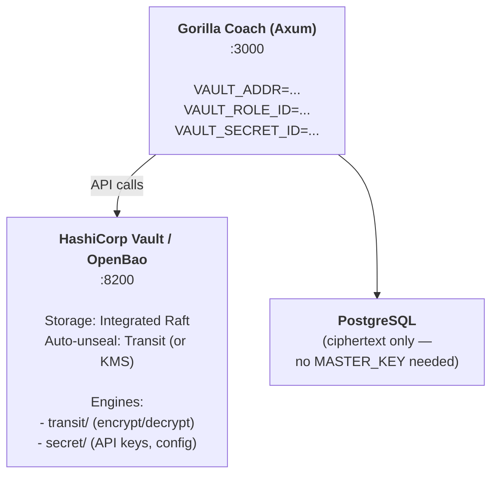

# Vault Architecture: Local ChaCha20 vs. HashiCorp Vault

## Executive Summary

**Short answer: No — HashiCorp Vault does not make sense for Gorilla Coach today.** The current `vault.rs` (ChaCha20-Poly1305 with a static `MASTER_KEY`) is the correct choice for a self-hosted, single-binary, small-user-count fitness app running on a private Tailscale network. HashiCorp Vault solves problems this project does not have, and introduces operational complexity that actively harms the self-hosted simplicity that defines this project.

However, there is a clear threshold where HashiCorp Vault *would* make sense. This document explains both sides in detail so you can make an informed decision as the project evolves.

---

## 1. What the Current Vault Does

### The Code (`src/vault.rs`)

```rust
pub struct Vault {
    cipher: ChaCha20Poly1305,  // AEAD cipher, 256-bit key
}

impl Vault {
    pub fn new(master_key: &str) -> Self {
        // Takes first 32 bytes of MASTER_KEY env var
        let key: [u8; 32] = key_bytes[..32].try_into().expect("key slice");
        Self { cipher: ChaCha20Poly1305::new(Key::from_slice(&key)) }
    }

    pub fn encrypt(&self, data: &str) -> (String, String) {
        // Random 12-byte nonce per encryption
        // Returns (base64_ciphertext, base64_nonce)
    }

    pub fn decrypt(&self, ct_b64: &str, nonce_b64: &str) -> anyhow::Result<String> {
        // Decrypts and returns plaintext
    }
}
```

### What It Protects (12 encrypt sites, 11 decrypt sites)

| Secret | Encrypt Location | Decrypt Location | Frequency |
|---|---|---|---|
| Garmin passwords | `settings.rs` (user saves creds) | `sync.rs` (re-login fallback), `auth.rs` (MFA retry), `settings.rs` (reconnect) | Once per save, decrypted during sync |
| Garmin OAuth sessions | `settings.rs`, `auth.rs`, `sync.rs` (multiple points in auth/refresh flow) | `sync.rs` (start of every sync), `admin.rs` (debug) | Encrypted after every token refresh, decrypted at sync start |
| Google refresh tokens | (not yet actively used, column exists) | — | — |

### Threat Model It Addresses

1. **Database breach**: If an attacker gets a PostgreSQL dump, all Garmin passwords and OAuth tokens are ciphertext. Useless without `MASTER_KEY`.
2. **Backup exposure**: Database backups (pg_dump, filesystem snapshots) don't leak plaintext credentials.
3. **Disk forensics**: If the server disk is seized or recycled, encrypted columns are unreadable.

### Threat Model It Does NOT Address

1. **Runtime memory compromise**: `MASTER_KEY` lives in process memory for the lifetime of the server. An attacker with memory read access (core dump, `/proc/pid/mem`, debugger) gets the key.
2. **Env var exposure**: `MASTER_KEY` is in `.env` on disk — if the filesystem is compromised, the key is immediately available alongside the database.
3. **No key rotation**: Changing `MASTER_KEY` requires re-encrypting every secret in the database manually. There's no built-in rotation mechanism.
4. **No audit trail**: There's no log of which secrets were accessed, when, or by which code path. The `tracing::info!` calls log sync attempts but not individual decrypt operations.
5. **No access policy**: Every part of the application that holds a `&Vault` reference can decrypt anything. There's no scoping (e.g., "the chat handler shouldn't be able to decrypt Garmin passwords").

---

## 2. What HashiCorp Vault Would Provide

HashiCorp Vault is a standalone server that manages secrets, encryption keys, and dynamic credentials. The relevant engines for Gorilla Coach:

### 2a. Transit Secrets Engine (Encryption-as-a-Service)

This is the direct replacement for `vault.rs`. Instead of encrypting locally with a static key, the app sends plaintext to Vault over an API, and Vault does the encryption with keys it manages internally.

```
Current flow:
  App (MASTER_KEY in memory) → ChaCha20 encrypt → base64 → PostgreSQL

Transit flow:
  App → HTTP POST /transit/encrypt/gorilla-key → Vault encrypts → returns ciphertext → PostgreSQL
  App → HTTP POST /transit/decrypt/gorilla-key → Vault decrypts → returns plaintext → App
```

**What this buys:**

| Capability | Current vault.rs | HashiCorp Transit |
|---|---|---|
| Encryption algorithm | ChaCha20-Poly1305 (fixed) | AES-256-GCM, ChaCha20, RSA (configurable) |
| Key storage | Env var on disk, in process memory | Vault's encrypted storage backend, never leaves Vault process |
| Key rotation | Manual re-encryption of all data | Automatic: new key version for new encrypts, old versions still decrypt old data |
| Key versioning | None | Yes — `vault write transit/keys/gorilla-key/rotate` creates v2, v1 still decrypts old ciphertext |
| Audit log | None | Every encrypt/decrypt logged with timestamp, accessor, key version |
| Access policy | Whoever has `&Vault` can do anything | ACL policies: "chat handler can only decrypt OAuth tokens, not Garmin passwords" |
| Performance | ~1 GB/s (in-process, zero network) | ~5,000-10,000 ops/sec (HTTP roundtrip per operation) |

**The code change would look like:**

```rust
// Before (current)
pub struct Vault {
    cipher: ChaCha20Poly1305,
}

impl Vault {
    pub fn encrypt(&self, data: &str) -> (String, String) {
        // In-process encryption
    }
}

// After (HashiCorp Transit)
pub struct Vault {
    client: reqwest::Client,
    vault_addr: String,
    vault_token: String,
}

impl Vault {
    pub async fn encrypt(&self, key_name: &str, data: &str) -> anyhow::Result<String> {
        let b64 = BASE64_STANDARD.encode(data.as_bytes());
        let resp = self.client
            .post(format!("{}/v1/transit/encrypt/{}", self.vault_addr, key_name))
            .header("X-Vault-Token", &self.vault_token)
            .json(&serde_json::json!({"plaintext": b64}))
            .send().await?;
        let body: serde_json::Value = resp.json().await?;
        Ok(body["data"]["ciphertext"].as_str().unwrap().to_string())
        // Returns "vault:v1:base64ciphertext" — version-tagged
    }

    pub async fn decrypt(&self, key_name: &str, ciphertext: &str) -> anyhow::Result<String> {
        let resp = self.client
            .post(format!("{}/v1/transit/decrypt/{}", self.vault_addr, key_name))
            .header("X-Vault-Token", &self.vault_token)
            .json(&serde_json::json!({"ciphertext": ciphertext}))
            .send().await?;
        let body: serde_json::Value = resp.json().await?;
        let b64 = body["data"]["plaintext"].as_str().unwrap();
        Ok(String::from_utf8(BASE64_STANDARD.decode(b64)?)?)
    }
}
```

**Critical differences in the interface:**
- `encrypt`/`decrypt` become `async` (network call to Vault server)
- Ciphertext is a single version-tagged string (`vault:v1:...`) instead of separate `(ciphertext, nonce)` pairs
- A `key_name` parameter enables scoping: `"garmin-passwords"`, `"oauth-tokens"`, `"google-tokens"` can be separate keys with separate rotation policies
- The DB schema simplifies: one `encrypted_blob TEXT` column instead of `encrypted_data TEXT` + `nonce TEXT`

### 2b. KV Secrets Engine (Static Secret Storage)

For secrets that don't belong in PostgreSQL at all — like the Gemini API key, Google OAuth client secret, or the Google Service Account private key. Currently these live in `.env`:

```bash
# Current: plaintext in .env
GEMINI_API_KEY=AIza...
GOOGLE_CLIENT_SECRET=GOC...
```

With KV v2, these move into Vault:

```bash
vault kv put secret/gorilla-coach/gemini api_key=AIza...
vault kv put secret/gorilla-coach/google client_secret=GOC...
```

The app fetches them at startup:

```rust
let gemini_key = vault_client
    .get("/v1/secret/data/gorilla-coach/gemini")
    .send().await?
    .json::<Value>()["data"]["data"]["api_key"]
    .as_str().unwrap().to_string();
```

**What this buys:** API keys are never on disk. `.env` only contains `VAULT_ADDR` and `VAULT_TOKEN` (or uses AppRole auth). Vault provides versioning and audit logging for all secret reads.

### 2c. Database Secrets Engine (Dynamic Credentials)

Instead of a static `DATABASE_URL` with a permanent password, Vault can generate short-lived PostgreSQL credentials on demand:

```
App → Vault: "I need a database connection"
Vault → PostgreSQL: CREATE ROLE gorilla_xxxx WITH PASSWORD '...' VALID UNTIL '2026-02-21 13:00:00'
Vault → App: "Here's your username/password, valid for 1 hour"
```

After the lease expires, Vault automatically revokes the role. This means:
- No permanent database password exists
- If a credential leaks, it's only valid for the lease duration
- Revocation is automatic

**Realistically, this is overkill for Gorilla Coach.** The database is on the same machine or private network. A static `DATABASE_URL` is fine.

---

## 3. The Operational Cost of HashiCorp Vault

This is where the analysis shifts decisively. HashiCorp Vault is not free software you drop in — it's an infrastructure service that demands ongoing operational attention.

### 3a. Deployment Complexity

```
Current deployment:
  1. cargo build --release
  2. Set .env variables
  3. ./gorilla_coach server
  Done. One binary, one config file.

With HashiCorp Vault:
  1. Deploy Vault server (separate binary/container)
  2. Choose and configure storage backend (file, Consul, PostgreSQL, Raft)
  3. Initialize Vault (generates 5 unseal keys + root token)
  4. Unseal Vault (requires 3 of 5 keys — EVERY TIME IT RESTARTS)
  5. Enable Transit engine: vault secrets enable transit
  6. Create encryption key: vault write -f transit/keys/gorilla-passwords
  7. Create policies (ACL rules for what gorilla_coach can access)
  8. Create AppRole or Token for gorilla_coach to authenticate
  9. Configure gorilla_coach with VAULT_ADDR + VAULT_TOKEN
  10. cargo build --release && ./gorilla_coach server
```

### 3b. The Unseal Problem

This is the single biggest operational burden. Vault encrypts its own storage with a master key that is split into shares (Shamir's Secret Sharing). **Every time Vault restarts, it starts sealed** — it cannot serve requests until enough key shares are provided to reconstruct the master key.

For a self-hosted fitness app on a home server:
- Power outage → Vault restarts → sealed → **Gorilla Coach cannot start until you manually unseal**
- OS update + reboot → same
- Docker container restart → same

**Mitigations exist but add more complexity:**
- **Auto-unseal with cloud KMS**: Vault uses AWS KMS / GCP KMS / Azure Key Vault to auto-unseal. But now you depend on a cloud provider, which defeats the self-hosted goal.
- **Auto-unseal with local HSM**: Requires a hardware security module. Cost: $500+.
- **Transit auto-unseal**: Use *another* Vault to unseal this Vault. Turtles all the way down.

### 3c. High Availability

Vault is designed for HA clusters (3-5 nodes with Raft consensus). Running a single Vault node is a single point of failure. If Vault goes down, Gorilla Coach cannot encrypt or decrypt anything — which means:
- No Garmin sync (can't decrypt OAuth tokens)
- No settings save (can't encrypt passwords)
- No MFA verification (can't decrypt stored credentials)

The current `vault.rs` has zero availability risk — it's in-process. If the app is running, encryption works.

### 3d. Backup & Recovery

With the current approach:
- Back up `.env` (has `MASTER_KEY`) + PostgreSQL dump → you can restore everything

With HashiCorp Vault:
- Back up Vault's storage backend + unseal keys + PostgreSQL dump → you can restore everything
- **Lose the unseal keys? All secrets in Vault are permanently lost.** There is no recovery. This is the correct behavior for high-security environments, but terrifying for a home server.

### 3e. License Considerations

HashiCorp switched Vault to the Business Source License (BSL 1.1) in August 2023. The community fork is **OpenBao** (MPL 2.0). For self-hosted non-commercial use, BSL is fine. But if you ever distribute Gorilla Coach as a product, you'd need to evaluate BSL compliance or use OpenBao instead.

---

## 4. Decision Matrix

| Factor | Current vault.rs | HashiCorp Vault |
|---|---|---|
| **Deployment complexity** | Zero (in-process) | High (separate server, storage backend, unseal) |
| **Operational burden** | None | Ongoing (unsealing, monitoring, upgrades, backups) |
| **Availability** | Same as app process | Separate failure domain — if Vault down, app crippled |
| **Key rotation** | Manual (re-encrypt all data) | Built-in (version-tagged ciphertext, zero downtime) |
| **Audit logging** | None | Full (every encrypt/decrypt logged with accessor) |
| **Access control** | None (any code with `&Vault` can decrypt anything) | ACL policies per key, per operation |
| **Key exposure** | In process memory + `.env` on disk | Key never leaves Vault process; only ciphertext returned |
| **Performance** | ~1 GB/s (in-process) | ~5-10K ops/sec (HTTP roundtrip) |
| **Dependency** | 1 crate (chacha20poly1305) | Vault server + storage backend + network |
| **Recovery** | Back up `.env` + pg_dump | Back up unseal keys + Vault storage + pg_dump |
| **User count sweet spot** | 1–100 users, self-hosted | 100+ users, team-operated, compliance requirements |

---

## 5. When HashiCorp Vault Becomes the Right Answer

HashiCorp Vault makes sense when **any** of these become true:

### 5a. Regulatory Compliance

If Gorilla Coach starts handling data subject to HIPAA (health data in the US), GDPR Article 32 (EU), or SOC 2 requirements, auditors will ask:
- "Where are your encryption keys stored?" — `.env` file is not an acceptable answer.
- "Can you audit who accessed which secrets and when?" — No, currently.
- "Do you have a key rotation policy?" — No, currently.
- "Is there separation of duties between the application and key management?" — No, same process.

### 5b. Multi-Operator Deployment

If multiple people operate Gorilla Coach instances and you need:
- Different operators to have different access levels (admin can manage keys, app only encrypts/decrypts)
- Revocation when an operator leaves
- Centralized secret management across multiple instances

### 5c. Dynamic Credentials for External Services

If Gorilla Coach starts integrating with more APIs (Whoop, Oura, Apple Health, Strava) each with their own OAuth tokens, the number of secrets grows. At some point, managing encrypted credentials in PostgreSQL columns becomes unwieldy compared to a purpose-built secret store.

### 5d. Key Rotation Becomes Mandatory

If you suspect `MASTER_KEY` has been compromised, the current approach requires:
1. Generate new key
2. Write a migration script that decrypts every secret with the old key and re-encrypts with the new key
3. Run it atomically (no partial state)
4. Update `.env`
5. Restart

With Transit, it's: `vault write -f transit/keys/gorilla-passwords/rotate`. Done. New encryptions use v2. Old ciphertext still decrypts with v1.

---

## 6. Recommended Architecture If You Adopt Vault

If you do cross the threshold described in Section 5, here's the target architecture:

### 6a. Topology



### 6b. Transit Key Layout

```
transit/keys/garmin-passwords     # Garmin account passwords
transit/keys/garmin-sessions      # Serialized GarminSession JSON (OAuth1+OAuth2)
transit/keys/google-tokens        # Google OAuth refresh tokens
transit/keys/api-secrets          # Future: any additional API credentials
```

Each key can have an independent rotation policy:

```bash
# Rotate Garmin session key every 30 days (sessions refresh frequently anyway)
vault write transit/keys/garmin-sessions auto_rotate_period=720h

# Rotate password key every 90 days
vault write transit/keys/garmin-passwords auto_rotate_period=2160h
```

### 6c. ACL Policies

```hcl
# policy: gorilla-coach-app
path "transit/encrypt/garmin-passwords" {
  capabilities = ["update"]
}
path "transit/decrypt/garmin-passwords" {
  capabilities = ["update"]
}
path "transit/encrypt/garmin-sessions" {
  capabilities = ["update"]
}
path "transit/decrypt/garmin-sessions" {
  capabilities = ["update"]
}
path "transit/encrypt/google-tokens" {
  capabilities = ["update"]
}
path "transit/decrypt/google-tokens" {
  capabilities = ["update"]
}
path "secret/data/gorilla-coach/*" {
  capabilities = ["read"]
}

# The app CANNOT:
# - Read the raw encryption key material
# - Rotate keys (that's an admin action)
# - Delete keys
# - Access other apps' secrets
```

### 6d. Authentication: AppRole

Instead of a static `VAULT_TOKEN`, use AppRole (machine-oriented auth):

```rust
// At startup, exchange role_id + secret_id for a short-lived token
let login_resp = client
    .post(format!("{}/v1/auth/approle/login", vault_addr))
    .json(&json!({
        "role_id": env::var("VAULT_ROLE_ID")?,
        "secret_id": env::var("VAULT_SECRET_ID")?,
    }))
    .send().await?;

let vault_token = login_resp.json::<Value>()?["auth"]["client_token"]
    .as_str().unwrap().to_string();
let lease_duration = login_resp.json::<Value>()?["auth"]["lease_duration"]
    .as_u64().unwrap();

// Token auto-renewal in background task
tokio::spawn(async move {
    loop {
        tokio::time::sleep(Duration::from_secs(lease_duration / 2)).await;
        let _ = client.post(format!("{}/v1/auth/token/renew-self", vault_addr))
            .header("X-Vault-Token", &vault_token)
            .send().await;
    }
});
```

### 6e. Database Schema Changes

The dual-column pattern (`encrypted_data` + `nonce`) simplifies to a single column:

```sql
-- Before
ALTER TABLE user_settings
  ADD COLUMN garmin_oauth_token TEXT,
  ADD COLUMN garmin_oauth_token_nonce TEXT;

-- After (Transit ciphertext is self-contained: "vault:v1:base64...")
ALTER TABLE user_settings
  ADD COLUMN garmin_oauth_token TEXT;  -- stores "vault:v1:..." directly
  -- nonce column no longer needed (Vault manages it internally)
```

Migration path:
1. Deploy new code that reads both formats (detect `vault:v1:` prefix vs. legacy base64)
2. Run a background job that decrypts legacy format with old `vault.rs`, re-encrypts via Transit
3. Drop the `_nonce` columns after migration completes

### 6f. Vault Trait Abstraction

To support both backends during migration (and for testing), abstract behind a trait:

```rust
#[async_trait]
pub trait SecretVault: Send + Sync {
    async fn encrypt(&self, key_name: &str, plaintext: &str) -> anyhow::Result<String>;
    async fn decrypt(&self, key_name: &str, ciphertext: &str) -> anyhow::Result<String>;
}

// Current implementation
pub struct LocalVault { cipher: ChaCha20Poly1305 }

#[async_trait]
impl SecretVault for LocalVault {
    async fn encrypt(&self, _key_name: &str, plaintext: &str) -> anyhow::Result<String> {
        let (ct, nonce) = self.encrypt_inner(plaintext);
        Ok(format!("local:{}:{}", nonce, ct))  // pack nonce into ciphertext string
    }
    async fn decrypt(&self, _key_name: &str, ciphertext: &str) -> anyhow::Result<String> {
        let parts: Vec<&str> = ciphertext.splitn(3, ':').collect();
        self.decrypt_inner(parts[2], parts[1])
    }
}

// HashiCorp implementation
pub struct HashiCorpVault { client: reqwest::Client, addr: String, token: String }

#[async_trait]
impl SecretVault for HashiCorpVault {
    async fn encrypt(&self, key_name: &str, plaintext: &str) -> anyhow::Result<String> {
        // HTTP call to /v1/transit/encrypt/{key_name}
    }
    async fn decrypt(&self, key_name: &str, ciphertext: &str) -> anyhow::Result<String> {
        // HTTP call to /v1/transit/decrypt/{key_name}
    }
}
```

`AppState` would hold `Arc<dyn SecretVault>` instead of `Arc<Vault>`, selected by config:

```rust
let vault: Arc<dyn SecretVault> = if env::var("VAULT_ADDR").is_ok() {
    Arc::new(HashiCorpVault::new(/* ... */))
} else {
    Arc::new(LocalVault::new(&config.master_key))
};
```

---

## Day-2 Operations: Vault Maintenance

### Verifying the Master Key

The `test-vault` CLI command encrypts and decrypts a test secret to verify
`MASTER_KEY` is correct:

```bash
set -a && source .env && set +a && cargo run -- test-vault "my secret"
```

Expected output:
```
Encrypted: <base64> | Nonce: <base64>
✅ Decryption Verified: my secret
```

If the key is too short (< 32 bytes), the process panics:
```
MASTER_KEY must be at least 32 bytes, got {len}. Use a strong random key.
```

### What Happens When MASTER_KEY Changes

Changing `MASTER_KEY` invalidates **all stored encrypted data**:
- Garmin passwords (`encrypted_garmin_password` + `nonce`)
- Garmin OAuth tokens (`garmin_oauth_token` + `garmin_oauth_token_nonce`)
- Google refresh tokens (`google_refresh_token` + `google_refresh_token_nonce`)

The symptom: the background sync fails with:
```
Could not decrypt OAuth token. Check MASTER_KEY.
```

And `vault.decrypt()` returns `anyhow::anyhow!("Decryption failed")` (the
ChaCha20Poly1305 AEAD authentication tag doesn't match).

**Recovery**: Users must re-enter their Garmin credentials and re-authenticate
Google OAuth via the Settings page. There is no way to recover data encrypted
with the old key unless you still have it.

### Rotating MASTER_KEY (Manual Process)

There is no automated key rotation yet. To rotate manually:

1. **Record the old key**: `echo $MASTER_KEY`
2. **Generate a new key**: `openssl rand -hex 32`
3. **Write a migration script** that:
   - Decrypts all secrets with the old key
   - Re-encrypts with the new key
   - Updates the DB rows in a transaction
4. **Update `.env`** with the new key
5. **Restart the server**

```bash
# Quick verification after rotation
cargo run -- test-vault "rotation test"
```

### Auditing Encrypted Data Access

Currently, there are no audit logs for decrypt operations. To add them
without code changes, use debug logging:

```bash
RUST_LOG=gorilla_coach::vault=debug cargo run -- server
```

This won't catch individual decrypt calls (the vault module doesn't log at
that granularity), but handler-level debug logs show when settings are loaded
(which triggers decryption).

### Encrypted Column Inventory

| Column | Nonce Column | Table | Stores |
|---|---|---|---|
| `encrypted_garmin_password` | `nonce` | `user_settings` | Garmin SSO password |
| `garmin_oauth_token` | `garmin_oauth_token_nonce` | `user_settings` | Serialized GarminSession |
| `google_refresh_token` | `google_refresh_token_nonce` | `user_settings` | Google OAuth refresh token |

All are stored as base64-encoded strings. The nonce is unique per encryption
operation. Re-encrypting the same plaintext produces different ciphertext
(different random nonce each time).

---

## 7. Recommendation

**Stay with `vault.rs` (ChaCha20-Poly1305, static MASTER_KEY)** for the foreseeable future. The reasons:

1. **The deployment target is a single self-hosted server on a private Tailscale network.** The threat model is "protect data at rest in case of disk/backup exposure." ChaCha20-Poly1305 with a 256-bit key is cryptographically excellent for this.

2. **The user count is 1-10.** The number of encrypted secrets is in the dozens, not thousands. Key rotation is a rare event that can be done manually.

3. **Operational simplicity is a feature, not a compromise.** One binary + `.env` + PostgreSQL is the correct complexity level. Adding a Vault server doubles the infrastructure surface area for marginal security gain in this threat model.

4. **The actual risk is not the encryption algorithm or key management.** If someone compromises a self-hosted server enough to read `.env`, they can also read process memory where a Vault token would live. HashiCorp Vault shifts the trust boundary but doesn't eliminate it for a single-operator deployment.

### What To Improve Without HashiCorp Vault

If you want to harden the current approach without the operational overhead:

1. **Add key rotation support**: Store a `key_version` alongside ciphertext. Support decrypting with old keys during rotation. This is 50 lines of code, not a new service.

2. **Encrypt `MASTER_KEY` at rest**: Use Linux kernel keyring or `systemd-creds encrypt` to protect the key on disk instead of plaintext `.env`. The OS handles decryption only for the owning service.

3. **Add decrypt audit logging**: Add a `tracing::debug!("vault_decrypt: key=garmin_password user_id={}", user_id)` at each decrypt call site. Cheap, retroactive, and gives you an audit trail in your existing log infrastructure.

4. **Separate encryption keys by purpose**: Use different `MASTER_KEY_GARMIN`, `MASTER_KEY_GOOGLE`, etc. in `.env`. Different `Vault` instances in `AppState`. This gives logical separation without a new service. If one key is compromised, the other secrets remain protected.
