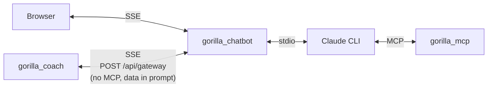
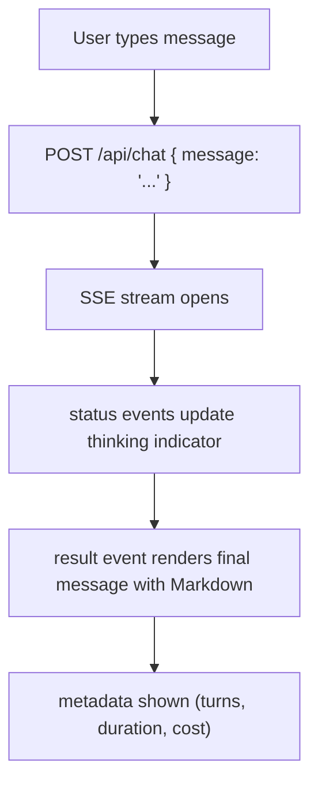

# Chatbot

The gorilla_chatbot crate provides a web-based chat interface and an LLM gateway. It spawns Claude CLI processes with MCP tools attached, streams responses via SSE, and manages conversation history.

## Overview



## Routes

| Method | Path | Description |
|--------|------|-------------|
| `GET /` | Serves `static/index.html` | Chat frontend |
| `POST /api/chat` | Send a message, receive SSE stream | Main chat endpoint |
| `POST /api/stop` | Cancel current request | Kills Claude CLI process |
| `GET /api/health` | Health check | Returns `{"status": "ok"}` |
| `GET /api/history` | Get conversation history | Returns history entries |
| `POST /api/gateway` | LLM gateway for gorilla_coach | Only when `GATEWAY_API_KEY` is set |

## MCP Mode (Chat)

### How It Works

1. User sends a message via `POST /api/chat`
2. Chatbot builds an MCP config JSON pointing to `gorilla_mcp` with all env vars
3. Spawns Claude CLI:
   ```
   claude -p --output-format stream-json --verbose \
     --mcp-config /tmp/mcp-config.json \
     --model sonnet \
     --system-prompt "..." \
     --permission-mode bypassPermissions
   ```
4. Writes the user message to Claude's stdin
5. Reads Claude's stdout as newline-delimited JSON events
6. Forwards events to the browser as SSE

### SSE Events

**Status events** (during processing):
```
event: status
data: {"event_type": "init", "message": "Starting..."}

event: status
data: {"event_type": "tool_call", "message": "Calling get_sitrep..."}

event: status
data: {"event_type": "tool_ok", "message": "get_sitrep complete"}
```

Event types: `init`, `connected`, `tool_call`, `tool_ok`, `tool_error`, `stopped`

**Result event** (final response):
```
event: result
data: {"response": "Your HRV is 94ms...", "is_error": false, "cost_usd": 0.0234, "duration_ms": 4521, "num_turns": 3}
```

### Conversation History

The chatbot maintains a server-side conversation history:

- Stored as a JSON file at `HISTORY_PATH`
- Max 20 entries (oldest truncated)
- Each entry has `role` (user/assistant) and `content`
- History is injected into the system prompt so Claude has context across turns
- `GET /api/history` returns the current entries
- History persists across container restarts (when using a Docker volume)

### System Prompt

The chatbot constructs a system prompt that includes:
- Base coaching instructions
- Conversation history (last 20 turns)
- Current date/time

## Gateway Mode

Gateway mode turns the chatbot into an LLM backend that gorilla_coach can call to get Claude's analysis without MCP tools (gorilla_coach bakes the data directly into the prompt).

### Enabling

Set `GATEWAY_API_KEY` environment variable to any non-empty string. This shared secret must match between gorilla_coach and the chatbot.

### Authentication

Gateway requests must include:
```
X-API-Key: your_shared_secret
```

Authentication uses constant-time comparison (`subtle` crate) to prevent timing attacks.

### Request Format

```json
POST /api/gateway
Content-Type: application/json
X-API-Key: your_shared_secret

{
  "prompt": "Analyze this training data: ...",
  "system": "You are a strength training coach.",
  "model": "sonnet"
}
```

### Response

Same SSE stream as MCP mode, but Claude runs without MCP tools. The response is purely based on the data gorilla_coach embedded in the prompt.

### Differences from MCP Mode

| | MCP Mode | Gateway Mode |
|---|----------|-------------|
| Endpoint | `POST /api/chat` | `POST /api/gateway` |
| Auth | None (local UI) | `X-API-Key` header |
| MCP tools | Yes (gorilla_mcp attached) | No |
| Data source | Tools fetch from APIs | Baked into prompt by caller |
| History | Server-side, persistent | None |
| Client | Browser | gorilla_coach |

## Frontend

### Technology

Single HTML file (`static/index.html`, ~850 lines) with embedded CSS and JavaScript. No build step, no framework, no external dependencies.

### Design

- Dark theme with amber and green accents
- JetBrains Mono (monospace) + Oswald (display) fonts
- Subtle scanline overlay effect
- Responsive layout (max-width 780px)

### Features

- **Markdown rendering** — Code blocks, tables, headers, bold/italic, lists, links
- **SSE streaming** — Real-time status updates during tool execution
- **Thinking indicator** — Animated dots with status text (e.g., "Calling get_sitrep...")
- **Send/Stop/Clear** — Send messages, cancel in-flight requests, clear local history

### Message Flow



## Building and Running

### Local Development

```bash
# Build both binaries
./scripts/build.sh all

# Run chatbot (requires gorilla_mcp binary in same directory or MCP_BINARY set)
COACH_BASE_URL=... COACH_API_KEY=... \
GARMIN_BASE_URL=... GARMIN_API_KEY=... GARMIN_USER_ID=... \
./target/release/gorilla_chatbot
```

Open `http://localhost:8080` in your browser.

### Docker Deployment

See [Deployment Guide](deployment.md) for Docker Compose + Tailscale setup.

```bash
docker compose -f docker-compose.chatbot.yaml up -d --build
```

### Configuration

See [Configuration](configuration.md) for all environment variables.
