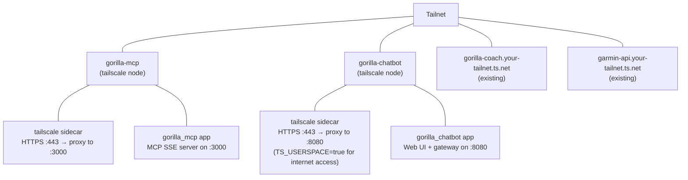

# Deployment

Gorilla MCP deploys as Docker containers with Tailscale sidecar networking. Each service gets its own Tailscale node, accessible only within your tailnet.

## Prerequisites

- Docker and Docker Compose
- A Tailscale account with an [auth key](https://tailscale.com/kb/1085/auth-keys)
- Running gorilla_coach and garmin_api instances (accessible from your tailnet)
- For chatbot: Claude CLI credentials (`~/.claude/.credentials.json`)

## Architecture



Each service uses Tailscale Serve to expose its port via HTTPS with automatic TLS certificates.

## Setup

### 1. Environment

```bash
cp .env.example .env
# Fill in all values, especially TS_AUTHKEY
```

### 2. MCP Server

The MCP server is the core — it must be deployed for the chatbot or any MCP client to work.

```bash
# Build and deploy
./scripts/deploy.sh up

# Verify
./scripts/deploy.sh status
```

This runs `docker-compose.yaml` which creates:
- `tailscale` service — Tailscale sidecar with hostname `gorilla-mcp`
- `app` service — gorilla_mcp in HTTP/SSE mode on port 3000

Once running, the MCP server is accessible at `https://gorilla-mcp.your-tailnet.ts.net`.

### 3. Chatbot (Optional)

The chatbot requires a separate compose file:

```bash
# Build
./scripts/build.sh all

# Deploy
docker compose -f docker-compose.chatbot.yaml up -d --build

# Check logs
docker compose -f docker-compose.chatbot.yaml logs app --tail 20
```

The chatbot needs internet access (to reach `api.anthropic.com`) so its Tailscale sidecar runs with `TS_USERSPACE=true` and dual DNS (Tailscale + public).

It also mounts your Claude CLI credentials:

```yaml
volumes:
  - ${HOME}/.claude/.credentials.json:/home/gorilla/.claude/.credentials.json:ro
```

Once running, the chatbot is accessible at `https://gorilla-chatbot.your-tailnet.ts.net`.

## Compose Files

### `docker-compose.yaml` (MCP Server)

```yaml
services:
  tailscale:
    image: tailscale/tailscale:latest
    hostname: gorilla-mcp
    environment:
      - TS_AUTHKEY=${TS_AUTHKEY}
      - TS_STATE_DIR=/var/lib/tailscale
      - TS_SERVE_CONFIG=/config/serve.json
    volumes:
      - ts-mcp-state:/var/lib/tailscale
      - ./docker/ts-serve-mcp.json:/config/serve.json:ro
    cap_add: [NET_ADMIN, SYS_MODULE]
    dns: [100.100.100.100]

  app:
    build:
      context: .
      dockerfile: docker/mcp.Dockerfile
    network_mode: service:tailscale
    environment:
      - TRANSPORT=http
      - PORT=3000
      - COACH_BASE_URL=${COACH_BASE_URL}
      - COACH_API_KEY=${COACH_API_KEY}
      # ... other env vars
    depends_on:
      tailscale:
        condition: service_healthy
```

Key points:
- `network_mode: service:tailscale` — app shares the Tailscale container's network
- App depends on Tailscale being healthy (connected to tailnet)
- DNS set to `100.100.100.100` (Tailscale MagicDNS) for resolving tailnet hostnames

### `docker-compose.chatbot.yaml` (Chatbot)

Similar structure but with additional requirements:
- `TS_USERSPACE=true` — enables userspace networking so the container can reach the public internet
- Dual DNS: `100.100.100.100` (Tailscale) + `8.8.8.8` (public) — needed to resolve both tailnet and public hostnames
- Mounts Claude CLI credentials read-only
- `chatbot-data` volume for persistent conversation history

## Tailscale Serve Config

Both services use Tailscale Serve to expose their ports via HTTPS:

```json
{
  "TCP": {
    "443": { "HTTPS": true }
  },
  "Web": {
    "${TS_CERT_DOMAIN}:443": {
      "Handlers": {
        "/": { "Proxy": "http://127.0.0.1:3000" }
      }
    }
  }
}
```

Tailscale handles TLS certificates automatically. The `${TS_CERT_DOMAIN}` is populated by Tailscale with the node's FQDN.

## Dockerfiles

### `docker/mcp.Dockerfile`

Minimal Debian image with the MCP server binary:

```dockerfile
FROM debian:trixie-slim
RUN apt-get update && apt-get install -y --no-install-recommends ca-certificates libssl3
RUN groupadd -g 1000 gorilla && useradd -u 1000 -g gorilla gorilla
WORKDIR /app
COPY target/release/gorilla_mcp .
RUN chmod +x gorilla_mcp
USER gorilla
ENTRYPOINT ["./gorilla_mcp", "--http"]
EXPOSE 3000
```

### `docker/chatbot.Dockerfile`

Larger image with Node.js (for Claude CLI) and both binaries:

```dockerfile
FROM debian:trixie-slim
RUN apt-get update && apt-get install -y --no-install-recommends \
    ca-certificates libssl3 curl
# Install Node.js 22.x + Claude Code CLI
RUN curl -fsSL https://deb.nodesource.com/setup_22.x | bash - \
    && apt-get install -y nodejs \
    && npm install -g @anthropic-ai/claude-code
COPY target/release/gorilla_chatbot target/release/gorilla_mcp /app/
ENTRYPOINT ["./gorilla_chatbot"]
EXPOSE 8080
```

## Operations

### Deploy Script

```bash
./scripts/deploy.sh up       # full build + deploy
./scripts/deploy.sh restart  # rebuild Docker image + restart app container
./scripts/deploy.sh status   # container status + recent logs
./scripts/deploy.sh logs     # follow live logs
./scripts/deploy.sh down     # stop all (volumes preserved)
```

`restart` is the fastest path for code changes — it rebuilds the Docker image from existing release artifacts and recreates the app container. Use `up` when you need a fresh Rust build.

### Updating

```bash
# Pull latest code
git pull

# Rebuild and redeploy
./scripts/build.sh mcp       # rebuild release binary
./scripts/deploy.sh restart  # redeploy container
```

### Logs

```bash
# Follow all logs
./scripts/deploy.sh logs

# Specific service
docker compose logs app --tail 50 -f
docker compose logs tailscale --tail 20

# Chatbot (separate compose file)
docker compose -f docker-compose.chatbot.yaml logs app --tail 50 -f
```

### Troubleshooting

**Container won't start — Tailscale unhealthy:**
- Check `TS_AUTHKEY` is valid and not expired
- Check Tailscale admin console for the node
- `docker compose logs tailscale` for auth errors

**MCP server starts but tools return errors:**
- Verify `COACH_BASE_URL` and `GARMIN_BASE_URL` are reachable from the container
- Check API keys are valid
- `docker compose exec app curl -s $COACH_BASE_URL/api/v2/settings -H "X-API-Key: $COACH_API_KEY"`

**Chatbot can't reach Claude API:**
- Ensure `TS_USERSPACE=true` is set on the chatbot's Tailscale sidecar
- Check dual DNS config (needs both Tailscale and public DNS)
- Verify Claude credentials are mounted correctly

**Stale MCP tools after redeploy:**
- The MCP client (Claude Code) caches the tool list. Run `/mcp` in Claude Code to reconnect.
