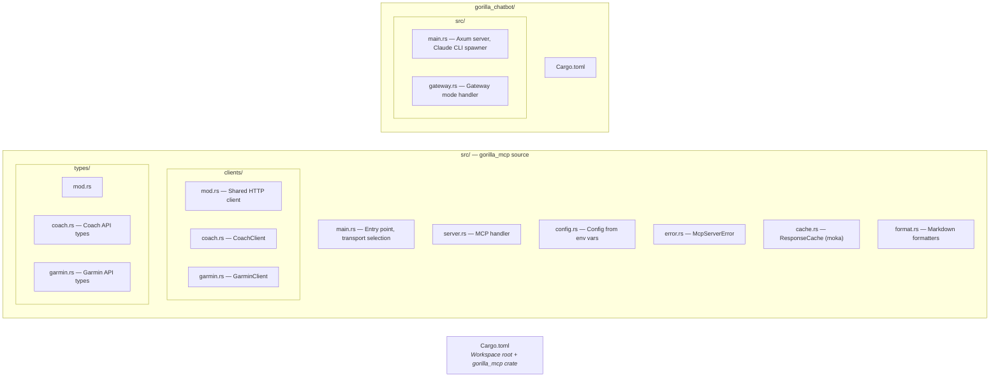

# Development

Guide for local development, building, testing, and extending the MCP server.

## Prerequisites

- **Rust:** 2024 edition (1.85+). Install via [rustup](https://rustup.rs/).
- **Running services:** gorilla_coach and garmin_api instances with API keys.
- **Claude Code:** For testing MCP tools locally. Install via `npm install -g @anthropic-ai/claude-code`.
- **Docker + Compose:** For deployment testing.

## Project Setup

```bash
git clone <repo-url>
cd gorilla_mcp

# Configure environment
cp .env.example .env
# Edit .env with your API keys and service URLs

# Build (debug)
cargo build --workspace

# Build (release)
./scripts/build.sh all
```

## Building

### Debug Build

```bash
cargo build --workspace          # both crates
cargo build -p gorilla_mcp       # MCP server only
cargo build -p gorilla_chatbot   # chatbot only
```

### Release Build

```bash
./scripts/build.sh all      # both (prints binary sizes)
./scripts/build.sh mcp      # MCP server only
./scripts/build.sh chatbot  # chatbot only
```

Release binaries go to `target/release/`.

### Check and Lint

```bash
cargo clippy --workspace -- -D warnings
cargo test --workspace
```

## Running Locally

### MCP Server (stdio)

The simplest way to test is through Claude Code. Add the server to `.mcp.json`:

```json
{
  "mcpServers": {
    "gorilla": {
      "command": "./target/release/gorilla_mcp",
      "env": {
        "COACH_BASE_URL": "https://...",
        "COACH_API_KEY": "...",
        "GARMIN_BASE_URL": "https://...",
        "GARMIN_API_KEY": "...",
        "GARMIN_USER_ID": "...",
        "RUST_LOG": "warn"
      }
    }
  }
}
```

Claude Code will spawn the server automatically. Use `/mcp` to reconnect after rebuilding.

### MCP Server (HTTP/SSE)

```bash
TRANSPORT=http PORT=3000 \
COACH_BASE_URL=... COACH_API_KEY=... \
GARMIN_BASE_URL=... GARMIN_API_KEY=... GARMIN_USER_ID=... \
./target/release/gorilla_mcp
```

Server listens on `http://127.0.0.1:3000` with SSE endpoint at `/sse`.

### Chatbot

```bash
COACH_BASE_URL=... COACH_API_KEY=... \
GARMIN_BASE_URL=... GARMIN_API_KEY=... GARMIN_USER_ID=... \
CLAUDE_MODEL=sonnet \
./target/release/gorilla_chatbot
```

Open `http://localhost:8080`.

## Workspace Structure



## Adding a New Tool

### 1. Add the Client Method

If the tool calls an upstream API, add a method to the appropriate client in `src/clients/`.

```rust
// src/clients/coach.rs
pub async fn get_new_thing(&self) -> Result<NewThingResponse, McpServerError> {
    check_response(self.get_req("/api/v2/new-thing").send().await?).await
}
```

### 2. Add Response Types

Add the response struct to `src/types/coach.rs` (or `garmin.rs`):

```rust
#[derive(Debug, Clone, Deserialize)]
pub struct NewThingResponse {
    pub data: String,
    pub count: i32,
}
```

Make sure field names exactly match the JSON keys from the upstream API. Use `#[serde(default)]` for optional fields that may be absent.

### 3. Add a Formatter

Add a formatting function to `src/format.rs`:

```rust
pub fn format_new_thing(resp: &NewThingResponse) -> String {
    format!("# New Thing\n\n- Data: {}\n- Count: {}", resp.data, resp.count)
}
```

Update the imports at the top of `format.rs` to include your new type.

### 4. Add the Tool

Add the tool method to the `#[rmcp::tool(tool_box)]` impl block in `src/server.rs`:

```rust
#[tool(description = "Get the new thing. Brief description of what it returns.")]
async fn get_new_thing(&self) -> String {
    match self.coach.get_new_thing().await {
        Ok(resp) => format::format_new_thing(&resp),
        Err(e) => e.to_tool_text(),
    }
}
```

Tool parameters are added as method parameters with `#[tool(param)]`:

```rust
#[tool(description = "Get the new thing for a specific date.")]
async fn get_new_thing(
    &self,
    #[tool(param)] date: Option<String>,
) -> String {
    // ...
}
```

### 5. Build and Test

```bash
cargo clippy --workspace -- -D warnings
cargo build -p gorilla_mcp --release
```

Then reconnect in Claude Code (`/mcp`) and test the tool.

## Adding a New Resource

Resources are defined in the `list_resources` and `read_resource` methods of `ServerHandler` in `src/server.rs`.

### 1. Add to `list_resources`

```rust
resource(
    "gorilla://new-resource",
    "New Resource",
    "Description of what this resource provides",
),
```

### 2. Add to `read_resource`

```rust
"gorilla://new-resource" => match self.coach.get_new_resource().await {
    Ok(resp) => format::format_new_resource(&resp),
    Err(e) => e.to_tool_text(),
},
```

## Adding a New Prompt

Prompts are defined in `list_prompts` and `get_prompt` in `src/server.rs`.

### 1. Add to `list_prompts`

```rust
Prompt::new(
    "new_prompt",
    Some("Description of the prompt"),
    Some(vec![PromptArgument {
        name: "arg_name".into(),
        description: Some("Argument description".into()),
        required: Some(false),
    }]),
),
```

### 2. Add to `get_prompt`

```rust
"new_prompt" => {
    let arg = args.get("arg_name").and_then(|v| v.as_str()).unwrap_or("default");
    Ok(GetPromptResult {
        description: Some("New prompt".into()),
        messages: vec![PromptMessage::new_text(
            PromptMessageRole::User,
            format!("Instructions for Claude using {arg}..."),
        )],
    })
}
```

## Caching Considerations

If your new tool calls an expensive or slow endpoint, consider caching:

```rust
#[tool(description = "...")]
async fn get_expensive_thing(&self) -> String {
    let client = self.coach.clone();
    self.cache
        .get_or_fetch("expensive_thing", || async move {
            match client.get_expensive_thing().await {
                Ok(resp) => format::format_expensive_thing(&resp),
                Err(e) => e.to_tool_text(),
            }
        })
        .await
}
```

Remember to add cache invalidation if write operations should clear this cache.

## Key Dependencies

| Crate | Purpose |
|-------|---------|
| `rmcp` | MCP protocol framework (server, stdio, SSE transports) |
| `tokio` | Async runtime |
| `reqwest` | HTTP client |
| `serde` / `serde_json` | Serialization |
| `chrono` | Date/time handling |
| `moka` | High-performance async cache |
| `tracing` | Structured logging |
| `thiserror` | Error type derivation |
| `axum` | Web framework (chatbot only) |
| `subtle` | Constant-time comparison (chatbot gateway auth) |

## Error Handling Pattern

All tools follow the same error pattern:

```rust
match self.client.do_thing().await {
    Ok(resp) => format::format_thing(&resp),
    Err(e) => e.to_tool_text(),  // Sanitized error message
}
```

`McpServerError::to_tool_text()` ensures internal details (URLs, response bodies) are never exposed to the MCP client. Errors are logged server-side with full detail.

## Type Alignment

Response types in `src/types/` must exactly match the JSON structure returned by upstream APIs. Mismatched field names cause silent deserialization failures (fields default to `None` or empty). When adding or updating types:

1. Check the upstream API's actual response (curl or browser dev tools)
2. Match field names exactly (use `#[serde(rename = "...")]` if needed)
3. Use `#[serde(default)]` for fields that may be absent
4. Use `Option<T>` for nullable fields
5. Test with a real API call to verify deserialization
